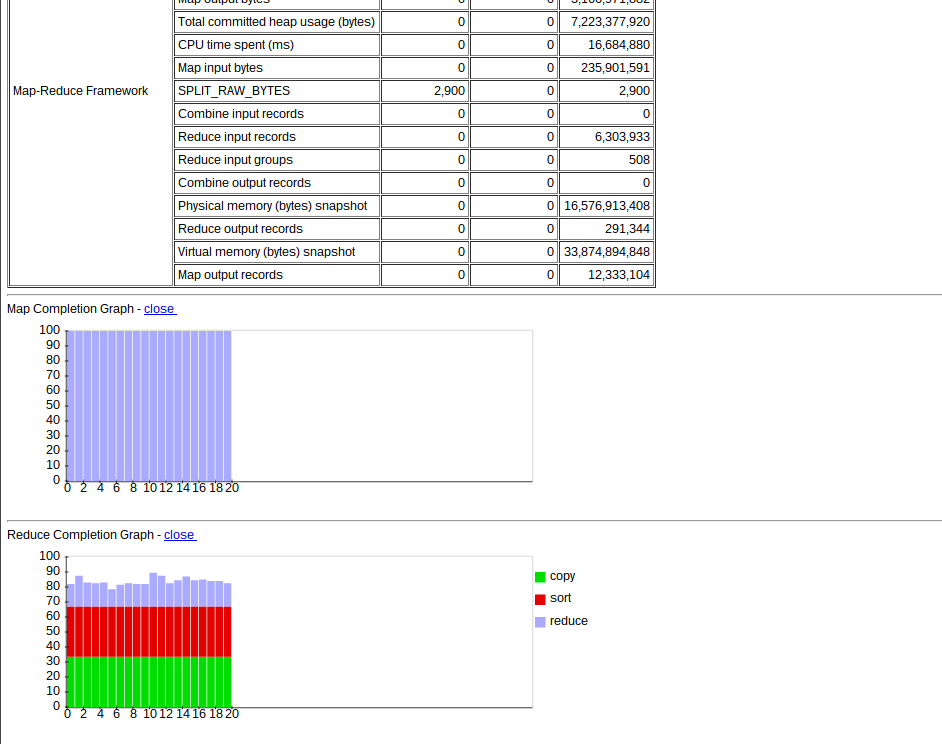



## Introduction

This is a tutorial that describes a way to quickly setup a Hadoop cluster on cheap Amazon EC2 spot instances. We then show how to interact with the cluster by writing and running a few example Hadoop streaming jobs in Python.

## Prerequisites

You'll need very basic UNIX command line knowledge. If you're feeling a little rusty, [here's a good tutorial](http://freeengineer.org/learnUNIXin10minutes.html). The code in this tutorial has been tested on Linux, but I'd imagine it could work on OSX and maybe even Cygwin.

Most of the code is written in Python (version 2.7), so if you've never used it before, you might want to have a look at [a short tutorial](http://www.stavros.io/tutorials/python/) or [a longer one](http://docs.python.org/2.7/tutorial/).

## Initial setup

Make sure you have Python 2.7 [installed](https://wiki.python.org/moin/BeginnersGuide/Download). You'll also need [pip](http://blog.troygrosfield.com/2010/12/18/installing-easy_install-and-pip-for-python/) (recommended) or easy_install to download Python packages. The examples assume you're running `bash` as your command line.

Download [headintheclouds](https://github.com/andreasjansson/head-in-the-clouds) (a tool for managing cloud servers):

    pip install headintheclouds

If you don't have root access, and you don't have pip installed, you can install the package by typing

    export PYTHONPATH=$PYTHONPATH:$HOME/local/lib/python2.7/site-packages
    export PATH=$PATH:$HOME/local/bin
    easy_install --prefix=$HOME/local headintheclouds

(You might want to put the `export` statements in your .bashrc or equivalent file.)

Download and unzip [no-headache-hadoop](https://github.com/andreasjansson/no-headache-hadoop) (a set of scripts that makes installing and configuring Hadoop easy):

    wget https://github.com/andreasjansson/no-headache-hadoop/archive/master.zip
    unzip master.zip

Next, we need to create an Amazon Web Services (AWS) account. Go to https://aws.amazon.com/ and click Sign Up. You'll be asked for address, phone number, credit card details, etc. When you've finished signing up, go to https://console.aws.amazon.com/iam/home?#security_credential

Click Continue to Security Credentials. Under Access Keys, click Create New Access Key.

Click Download Key File and store the rootkey.csv file somewhere secure. If you open this file you'll see two lines, AWSAccessKeyId and AWSSecretKey. We'll use these later on.

Next, go to https://console.aws.amazon.com/ and click EC2 (Elastic Compute Cloud, Amazon's cloud server offering). In the top right corner, change the region to US East (N. Virginia).

Under Network & Security, click Key Pairs. Click Create Key Pair and give it a name. When you click Create you'll download a .pem key file, move that file somewhere secure. You'll also need to remove the write permissions on this file, e.g.

    chmod 400 andreas-ec2.pem

Finally, we need to set a few [environment variables](http://www.cyberciti.biz/faq/set-environment-variable-linux/). You can set environment variables straight in the shell by typing `export NAME=VALUE`. The problem is that those variables will disappear next time you open a shell. To make them "stick" you can put the exports in your .bashrc file in your home directory.

 * Set `AWS_ACCESS_KEY_ID` to the AWSAccessKeyId from rootkey.csv
 * Set `AWS_SECRET_ACCESS_KEY` to the AWSSecretKey from rootkey.csv
 * Set `AWS_SSH_KEY_FILENAME` to the full path to the .pem key file, e.g. /home/andreas/secrets/andreas-ec2.pem
 * Set `AWS_KEYPAIR_NAME` to the name of the key pair, e.g. andreas-ec2

Here is an example of what your exports could look like:

    export AWS_ACCESS_KEY_ID=AKIJFKELJF98FNDNTHWQ
    export AWS_SECRET_ACCESS_KEY=9FYZlblKV3sl/7QblWbVcSQeavN64+iiyvAoXoJI
    export AWS_SSH_KEY_FILENAME=/home/andreas/secrets/andreas-ec2.pem
    export AWS_KEYPAIR_NAME=andreas-ec2

To manage our Hadoop cluster from the command line we'll use the no-headache-hadoop package we downloaded earlier. no-headache-hadoop is built on top of [fabric](http://docs.fabfile.org/), a tool written in Python for interacting with remote servers. All fabric commands, or _tasks_, are executed on the command line by typing `fab ` followed by the task name. The tasks are defined in a file called `fabfile.py`, and `fab ` must be run from the same directory as `fabfile.py`. Tasks can take arguments in the format

    fab COMMAND:X,Y,Z

Arguments can also be named

    fab COMMAND:ARG1=X,ARG2=Y,ARG3=Z

To see all the tasks provided by no-headache-hadoop, type

    fab -l

To confirm that our setup is working, `cd` to the no-headache-hadoop directory and type

    fab debug_ec2

The output should be something like

    [54.211.224.68] Executing task 'debug_ec2'
    Successfully connected to EC2

## Launching nodes

The real killer feature in AWS (at least for students and poorly funded academics) is their [spot instance](http://aws.amazon.com/ec2/spot-instances/) offering. To run EC2, Amazon needs a lot of excess capacity. Instead of letting
all that hardware sit idle, they allow people to bid on unused instances. The hourly asking price is set based on supply and demand and changes frequently. If your bid exceeds the asking price, the instances you asked for will be launched. But if the asking price increases above your bid, all instances will be terminated immediately (and you will not be charged for the partial hour). Fortunately, Hadoop offers ways to deal with this.

To see the current spot pricing, type `fab pricing`. The output looks something like:

    AMAZON EC2:

    size         compute_units  memory  recent  median  stddev  max    hourly_cost
    t1.micro                 2     0.6   0.013   0.010   0.005  0.020        0.020
    m1.small                 1     1.7   0.007   0.007   0.000  0.007        0.060
    m1.medium                2    3.75   0.013   0.013   0.000  0.013        0.120
    c1.medium                5     1.7   0.018   0.020   0.003  0.024        0.145
    m1.large                 4     7.5   0.030   0.060   0.148  0.500        0.240
    m2.xlarge              6.5    17.1   0.035   0.160   0.186  0.447        0.410
    m1.xlarge                8      15   0.052   0.054   0.020  0.200        0.480
    m3.xlarge               13      15   0.058   0.058   0.000  0.058        0.500
    c1.xlarge               20       7   0.070   0.070   0.000  0.070        0.580
    m2.2xlarge              13    34.2   0.070   0.070   0.000  0.070        0.820
    m3.2xlarge              26      30   0.115   0.115   0.040  0.200        1.000
    cc1.4xlarge           33.5      23   1.668   1.668   0.000  1.668        1.300
    m2.4xlarge              26    68.4   0.400   0.280   0.545  1.800        1.640
    cg1.4xlarge           33.5      22   2.100   2.100   0.775  2.100        2.100
    cc2.8xlarge             88    60.5   0.270   0.270   0.000  0.270        2.400
    cr1.8xlarge             88   244.0   0.343   0.343   0.083  0.510        3.500

`size` is the name Amazon gives instance types, `compute units` roughly correspond to CPUs, `memory` is the amount of RAM in GB. `recent` is the most recent spot price, `median`, `stddev` and `max` show the spot pricing over the past 24 hours. `hourly_cost` is the normal pay-as-you-go pricing. Looking at this table we see that spot instances are almost 10 times cheaper than normal instances.

To create new EC2 spot instances, type

    fab ec2.spot:ROLE,SIZE,PRICE,COUNT

where ROLE is a name we give the node, e.g. "slave"; SIZE is the instance size, e.g. "cc2.8xlarge"; PRICE is our bid, e.g. 0.28; COUNT is the number of nodes we want to launch (default 1).

To create normal ec2 instances, type

    fab ec2.create:ROLE,SIZE,COUNT

For this tutorial we'll create 10 worker nodes (slaves), one master, and one monitoring server. To keep costs down we'll make them all m1.medium instances with 3.75 GB memory and 2 [compute units](http://aws.amazon.com/ec2/faqs/#What_is_an_EC2_Compute_Unit_and_why_did_you_introduce_it). Currently, the price is $0.013/hour, and it's been constant for the past 24 hours, so it's probably safe to bid $0.015 (we'll only pay the asking price, even if our bid is higher).

The commands below will create 12 new servers, so **you will be charged _real money_ from this point on**.

    fab ec2.spot:master,m1.medium,0.015 &
    fab ec2.spot:monitoring,m1.medium,0.015 &
    fab ec2.spot:slave,m1.medium,0.015,10 &

(The ampersands at the end runs the command in the background so we create the instances in parallel.)

Side note: For new users, Amazon limits the number of instances to 20. You probably want to increase that to at least 50, using the form at https://aws.amazon.com/contact-us/ec2-request/

Once the requests have been fulfilled, we can type

`fab nodes`

which will list all instances managed by no-headache-hadoop, something like this:

    AMAZON EC2:

    name        size       ip_address      private_dns_name                status      launch_time              
    monitoring  m1.medium  54.237.35.79    ip-10-29-176-214.ec2.internal   running     2013-09-24 12:22:20+01:00
    slave       m1.medium  54.226.85.138   ip-10-182-130-122.ec2.internal  running     2013-09-24 12:22:20+01:00
    slave       m1.medium  54.226.136.131  ip-10-170-46-227.ec2.internal   running     2013-09-24 12:22:20+01:00
    slave       m1.medium  107.22.123.120  ip-10-169-14-198.ec2.internal   running     2013-09-24 12:22:20+01:00
    slave       m1.medium  54.221.78.152   ip-10-234-18-145.ec2.internal   running     2013-09-24 12:22:20+01:00
    slave       m1.medium  54.221.62.203   ip-10-158-92-242.ec2.internal   running     2013-09-24 12:22:20+01:00
    slave       m1.medium  107.21.175.247  ip-10-181-198-250.ec2.internal  running     2013-09-24 12:22:20+01:00
    master      m1.medium  54.234.195.161  ip-10-235-19-231.ec2.internal   running     2013-09-24 12:22:20+01:00
    slave       m1.medium  54.242.75.141   ip-10-181-159-97.ec2.internal   running     2013-09-24 12:22:20+01:00
    slave       m1.medium  54.226.27.0     ip-10-28-173-3.ec2.internal     running     2013-09-24 12:22:20+01:00
    slave       m1.medium  54.226.186.225  ip-10-235-28-235.ec2.internal   running     2013-09-24 12:22:20+01:00
    slave       m1.medium  54.227.34.142   ip-10-232-73-177.ec2.internal   running     2013-09-24 12:22:20+01:00

If you go to the web console at https://console.aws.amazon.com/ec2 you should see all instance names prefixed by "NHH-". This is a namespacing scheme to avoid no-headache-hadoop interfering with other instances you might have in your EC2 account. (If some of the instances are not prefixed with "NHH-" and you haven't created them outside of no-headache-hadoop, something has probably gone wrong and you should terminate those instances through the web interface to avoid wasting money.)

When you're done with our instances you **must** remember to terminate them using

    fab terminate

In order to access the servers we need to open up the EC2 firewall on the SSH port (22). We do that by typing

    fab ec2.firewall:open=22

While we're at it, let's open some other ports we'll use later on:

    fab ec2.firewall:open=80
    fab ec2.firewall:open=443
    fab ec2.firewall:open=50030
    fab ec2.firewall:open=50060

(80 is HTTP, 443 is HTTPS, 50030 and 50060 are used by the Hadoop web interface.)

## Installing the software

In the no-headache-hadoop repository, there is a folder called "puppet". It contains all the [puppet](http://docs.puppetlabs.com/) [manifests](http://docs.puppetlabs.com/learning/manifests.html#manifests) needed to install and configure Hadoop.

To install Hadoop on the servers we launched in the previous section, type

    fab build

This command will SSH into each of the servers in parallel, and install all the required software automatically. What software to install is determined by the role of the individual server.

Expect this step to take a few minutes and don't be surprised if some instances take longer than others to finish installing. If it appears to hang, you can kill the script (Ctrl-C) and try again.

## Hadoop overview

Before we move on to the example, it's probably good to look at what Hadoop actually is. This will just be a short overview, for a longer introduction to Hadoop, see http://developer.yahoo.com/hadoop/tutorial/. For the theoretical underpinnings, see [Google's original MapReduce paper](http://static.googleusercontent.com/external_content/untrusted_dlcp/research.google.com/en//archive/mapreduce-osdi04.pdf).

At the core of Hadoop is the [Hadoop Distributed File System](http://hadoop.apache.org/docs/stable/hdfs_design.html) (HDFS), a fault-tolerant, scalable file system optimised for few writes, many reads, and large files. Files are stored in 64MB blocks across multiple [data nodes](http://wiki.apache.org/hadoop/DataNode), with each block stored in several (3 by default) copies for redundancy. The [name node](http://wiki.apache.org/hadoop/NameNode) keeps an index of which block belonging to which file is stored on which server.

The input to a Hadoop job is usually one or a few very large tab-separated files that are processed sequentially, line by line. The [job tracker](http://wiki.apache.org/hadoop/JobTracker) splits and distributes the input to many [task tracker](http://wiki.apache.org/hadoop/TaskTracker) servers. The job tracker manages everything around the execution of jobs, e.g. taking failed task trackers out of the pool, combining results, etc.

A Hadoop job usually has two stages: map and reduce. The mapper transforms each input record to one (or sometimes more than one) intermediate record, in the format (key, output). These intermediates are then grouped by key, sorted, and fed to the reducer, that combines them into a single (or a few) outputs.

In our setup we run the name node and job tracker on the same master instance, and each slave runs both a data node and a task tracker. This is deliberate, the job tracker actually attempts to schedule tasks to the same machine that stores the data it will operate on.

Before we can start the cluster we need to format HDFS

    fab format

Now we can start the cluster using

    fab start

## Hadoop streaming

Hadoop is written in Java, and you used to have to write map/reduce jobs in Java too. Fortunately, nowadays Hadoop has a tool called [Hadoop streaming](http://hadoop.apache.org/docs/stable/streaming.html) that allows you to write Hadoop jobs in virtually any language. The streaming job reads input lines from stdin, processes the input, and writes the output to stdout.

A nice side effect of this is that we can test streaming jobs locally on the command line before we run them on the cluster:

    cat input | ./mapper | sort | ./reducer

## Monitoring servers

The monitoring server we created earlier is running [Graphite](http://graphite.wikidot.com/), and the master and slave nodes all send it system stats using [collectd](http://collectd.org/).

The output of `fab nodes` gives us the external IP for each server. In the example above, the monitoring server is at 54.237.35.79. If enter that in a browser, we get something that looks like this:

(Note that this can take quite a while to load the first time, since we're running on relatively weak m1.medium machines.)

In the pane on the left we can navigate Graphite -> collectd -> [server private DNS name] -> [metric group] -> [metric name].

The most important metric to keep an eye on is memory -> memory-used. Once that starts climbing towards 3GB, we are in trouble.

## Example application

Now that we have our cluster built and configured, we can start doing some actual work on it. In this example we'll [mine frequent itemsets](http://en.wikipedia.org/wiki/Association_rule_learning) of artists in the [lastfm360k](http://mtg.upf.edu/node/1671) dataset, using a [parallel version of FP-growth](http://infolab.stanford.edu/~echang/recsys08-69.pdf).

### Algorithm overview

In frequent itemset mining we aim to find subsets of items that occur in many transactions. The classic example is market basket analysis, where we want to find products that are frequently bought together. In this example we want to find sets of artists that occur in many people's Last.fm listening histories. The output will be a number of sets of artists, e.g.

    {{Metallica, Pantera, Iron Maiden},
     {DJ Slugo, Drexciya},
     {Tom Waits, Leonard Cohen, Neil Young, Ron Sexsmith}}

This could them be used in a recommendation system, e.g. "You like Metallica and Iron Maiden, so you'll probably also like Pantera".

We will use a version of the [FP-growth algorithm](http://en.wikipedia.org/wiki/Association_rule_learning#FP-growth_algorithm) that was designed as a five of map/reduce jobs.

The input data is in the format

    user id, artist id, artist name, play count

but we need it to be in the format

    user id, listening history

where the listening history is a set of artist names {artist1, artist2, artist3, ...}. The first map/reduce step is to transform the input to our format, saving the output in a file that we'll use as input to subsequent steps.

After that we'll count the number of occurrences, or _support_, of each artist in the entire dataset.

The third step is to split the set of artists up into a number of _shards_, by assigning a shard number to each artist. For example, if the artists are

    {A, B, C, D}

We might have artist shards like

    {A => 1, B => 1, C => 2, D => 2}

In the fourth step we compute the actual frequent itemsets. The trick here is to transform the data in a way that makes it possible to compute frequent itemsets in parallel. It turns out that we can do this by outputting each history record a number of times, once for each artist shard that appear in the history, along with the shard number.

Assume we're using the example artists shards from before, and we have the histories

    {{A, B}, {A, B, C}, {B, D}, {C, D}}

The output will be

    ({A, B}, 1)
    ({A, B, C}, 1)
    ({A, B, C}, 2)
    ({B, D}, 1)
    ({B, D}, 2)
    ({C, D}, 2)

The clever thing is that the history tuples can mined for frequent itemsets in isolation, since each artist shard has all of the listening histories that artist appears in. The speedup is almost linear with the number of added servers. The actual mining is done using traditional FP-growth.

The final step is to deduplicate the output from the FP-growth step.

To download and unzip the Python implementation we'll use in the examples below, type 

    wget https://github.com/andreasjansson/parallel-frequent-itemset-mining-lastfm360k/archive/master.zip
    unzip master.zip

### Downloading the dataset

We'll start off by downloading the dataset to the cluster itself. First we log in to the master node:

    fab -R master ssh

The `-R` tells fabric to only apply the command to nodes with a certain role, in this case `master`.

To do anything Hadoop-related on the server, we need to change user to hadoop:

    sudo su - hadoop

Once we're logged in we download and unpack the data using

    wget http://mtg.upf.edu/static/datasets/last.fm/lastfm-dataset-360K.tar.gz
    tar xzvf lastfm-dataset-360K.tar.gz

The files are in tsv format so we can import them straight into HDFS. We will use usersha1-artmbid-artname-plays.tsv which has 17 million records for 360,000 users, where a record consists of (user id, artist id, artist name, play count). If we look at the first few records we get an idea of what we're dealing with.

    head -n5 lastfm-dataset-360K/usersha1-artmbid-artname-plays.tsv

outputs

    00000c289a1829a808ac09c00daf10bc3c4e223b        3bd73256-3905-4f3a-97e2-8b341527f805    betty blowtorch 2137
    00000c289a1829a808ac09c00daf10bc3c4e223b        f2fb0ff0-5679-42ec-a55c-15109ce6e320    die Ärzte       1099
    00000c289a1829a808ac09c00daf10bc3c4e223b        b3ae82c2-e60b-4551-a76d-6620f1b456aa    melissa etheridge       897
    00000c289a1829a808ac09c00daf10bc3c4e223b        3d6bbeb7-f90e-4d10-b440-e153c0d10b53    elvenking       717
    00000c289a1829a808ac09c00daf10bc3c4e223b        bbd2ffd7-17f4-4506-8572-c1ea58c3f9a8    juliette & the licks    706

To import into HDFS, type

    hadoop dfs -copyFromLocal lastfm-dataset-360K/usersha1-artmbid-artname-plays.tsv /hadoop/lastfm-plays.tsv

This will copy the file to /hadoop/lastfm-plays.tsv in HDFS. We can browse HDFS using

    hadoop dfs -ls /
    hadoop dfs -ls /hadoop
    # etc.

For testing purposes we can download and unzip the dataset to our local machine using the same commands.

### Step 1/5: Preprocessing

As a first step we transform the data so that each line is in the format (user id, list of artists). The [mapper](https://github.com/andreasjansson/parallel-frequent-itemset-mining-lastfm360k/blob/master/preprocess/mapper.py) simply takes the input line and outputs (user id, artist name). The [reducer](https://github.com/andreasjansson/parallel-frequent-itemset-mining-lastfm360k/blob/master/preprocess/reducer.py) then reads the input lines that have been sorted in Hadoop streaming by user id, and keeps the artists in memory. When the user id changes or we reach the end of the file, we output the old user id along with all the artists we've collected. Note that this would not work if the records hadn't been sorted before the reduce step.

If we have downloaded the data to our local computer as well as to the master node, we can test the job locally:

    head -n1000 /path/to/lastfm-dataset-360K/usersha1-artmbid-artname-plays.tsv \
        | /path/to/pfp_lastfm360k/preprocess/mapper.py \
        | sort \
        | /path/to/pfp_lastfm360k/preprocess/reducer.py

This will output something like

    00000c289a1829a808ac09c00daf10bc3c4e223b        juliette & the licks    magica  dropkick murphys        edguy   red hot chili peppers       walls of jericho        the wallflowers jack off jill   the murmurs     the who maximum the hormone     judas priest    girlschool  le tigre        melissa etheridge       sandra nasic    bif naked       die Ärzte       the butchies    sleater-kinney  john mayer  letzte instanz  elvenking       london after midnight   tanzwut disciple        betty   team dresch     rob zombie      the rolling stones  lunachicks      mutyumu the bosshoss    jack johnson    the black dahlia murder rasputina       guano apes      babes in toyland    blue Öyster cult        horrorpops      goldfrapp       the killers     all:my:faults   l7      eluveitie       betty blowtorch     little big town schandmaul      all ends
    00001411dc427966b17297bf4d69e7e193135d89        simian mobile disco     arcade fire     the wombats     uffie   queen   ai aso  the fiery furnaces  death cab for cutie     have heart      nujabes the most serene republic        built to spill  patrick wolf    mstrkrft    the strokes     broken social scene     the last shadow puppets the secret handshake    the honorary title      little dragon       coldplay        stars   boris with michio kurihara      cancer bats     the microphones boris   animal collective       death from above 1979       heavy heavy low low     the libertines  m.i.a.  mgmt    deerhoof        michio kurihara okkervil river  owl city    breathe carolina        luminous orange coaltar of the deepers  polar bear club bright eyes     jim sturgess    hadouken!  digitalism       the album leaf  the rocket summer       arctic monkeys  fear before the march of flames hot hot heat    boris with merzbow  boys noize
    00004d2ac9316e22dc007ab2243d6fcb239e707d        castanets       baby dee        flairck andrew liles    the revolutionary army of the infant jesus  marc almond     the legendary pink dots 16 horsepower   frank london    charalambides   björk   amanda rogers   nalle       the one ensemble        current 93      carter tutti    jack rose       festival        pelt    jocelyn pook    antony and the johnsons     nurse with wound        john jacob niles        fovea hex       bill fay        michael gira    nick cave & the bad seeds   ane brun        einstürzende neubauten  larkin grimm    six organs of admittance        mariee sioux    soisong a hawk and a hacksaw        lux interna     jean parlette   coil    ulver   ghq     angels of light daniel higgs    matmos  orion rigel dommissea silver mt. zion       fern knight     marissa nadler
    [etc.]

To run streaming jobs in the cluster we use

    fab streaming:INPUT_PATH,OUTPUT_PATH,MAPPER,REDUCER,NMAPPERS,NREDUCERS

where
 * INPUT\_PATH is the HDFS path to the data we'll use as input to the job (accepts asterisk wildcards)
 * OUTPUT\_PATH is the HDFS path where we'll store the output
 * MAPPER is the local path to the mapper script
 * REDUCER is the local path to the reducer script (optional, if omitted we will store the map output in OUTPUT\_PATH)
 * NMAPPERES is the number of mappers to run (optional, if omitted Hadoop will choose a "reasonable" number, usually 2 mappers/task tracker)
 * NREDUCERS is the number of reducers to run (optional, usually 2 per task tracker if omitted)

We'll run the preprocess job as follows

    fab streaming:/hadoop/lastfm-plays.tsv,/hadoop/lastfm/preprocessed,/path/to/pfp_lastfm360k/preprocess/mapper.py,/path/to/pfp_lastfm360k/preprocess/reducer.py,20,20

This will take input from /hadoop/lastfm-plays.tsv and place the output in the HDFS directory /hadoop/lastfm/preprocessed, running 20 mappers and 20 reducers. The output should look like

    [54.234.195.161] Executing task 'streaming'
    [54.234.195.161] sudo: mkdir "/opt/streaming" || true
    [54.234.195.161] put: /home/andreas/projects/pfp_lastfm360k/preprocess/mapper.py -> /opt/streaming/mapper.py
    [54.234.195.161] put: /home/andreas/projects/pfp_lastfm360k/preprocess/reducer.py -> /opt/streaming/reducer.py
    [54.234.195.161] sudo: /opt/hadoop/bin/hadoop jar /opt/hadoop/contrib/streaming/hadoop-streaming-1.2.1.jar -D mapred.map.tasks=20 -D mapred.reduce.tasks=20 -input "/hadoop/lastfm-plays.tsv" -output "/hadoop/lastfm/preprocessed" -mapper "/opt/streaming/mapper.py " -file "/opt/streaming/mapper.py" -reducer "/opt/streaming/reducer.py " -file "/opt/streaming/reducer.py"
    [54.234.195.161] out: packageJobJar: [/opt/streaming/mapper.py, /opt/streaming/reducer.py, /tmp/hadoop/hadoop-unjar847809189279407926/] [] /tmp/streamjob3638713451144539867.jar tmpDir=null
    [54.234.195.161] out: 13/09/24 12:01:54 INFO util.NativeCodeLoader: Loaded the native-hadoop library
    [54.234.195.161] out: 13/09/24 12:01:54 WARN snappy.LoadSnappy: Snappy native library not loaded
    [54.234.195.161] out: 13/09/24 12:01:54 INFO mapred.FileInputFormat: Total input paths to process : 1
    [54.234.195.161] out: 13/09/24 12:01:57 INFO streaming.StreamJob: getLocalDirs(): [/tmp/hadoop/mapred/local]
    [54.234.195.161] out: 13/09/24 12:01:57 INFO streaming.StreamJob: Running job: job_201309241156_0001
    [54.234.195.161] out: 13/09/24 12:01:57 INFO streaming.StreamJob: To kill this job, run:
    [54.234.195.161] out: 13/09/24 12:01:57 INFO streaming.StreamJob: /opt/hadoop-1.2.1/libexec/../bin/hadoop job  -Dmapred.job.tracker=ec2-54-234-195-161.compute-1.amazonaws.com:9001 -kill job_201309241156_0001
    [54.234.195.161] out: 13/09/24 12:01:57 INFO streaming.StreamJob: Tracking URL: http://ip-10-235-19-231.ec2.internal:50030/jobdetails.jsp?jobid=job_201309241156_0001
    [54.234.195.161] out: 13/09/24 12:01:58 INFO streaming.StreamJob:  map 0%  reduce 0%
    [54.234.195.161] out:

Note the Tracking URL, `http://ip-10-235-19-231.ec2.internal:50030/jobdetails.jsp?jobid=job_201309241156_0001`. That is a link to the web interface where you can track progress of the job. Unfortunately, due to a [bug](https://issues.apache.org/jira/browse/HADOOP-2776), Hadoop exposes private DNS names rather than public IPs. Looking in fab nodes, we see that the master node public IP is 54.234.195.161, so we just replace `ip-10-235-19-231.ec2.internal` with `54.234.195.161`, and the final URL becomes `http://54.234.195.161:50030/jobdetails.jsp?jobid=job_201309241156_0001`. Going there in a browser shows us the job tracking page:

When the job is finished, the web interface looks like this

Here you see that the mapper output ~17 million records, and the reducer output ~360,000 records. This is exactly what we'd expect from the proprocessing step.

For convenience no-headache-hadoop has a couple of commands for looking into HDFS without having to log in to the master node. To look at the output, type

    fab ls:/hadoop/lastfm/preprocessed

You should see something like

    $ fab ls:/hadoop/lastfm/preprocessed
    [50.19.146.217] Executing task 'ls'
    [50.19.146.217] sudo: /opt/hadoop/bin/hadoop dfs -ls "/hadoop/lastfm/preprocessed"
    [50.19.146.217] out: Found 22 items
    [50.19.146.217] out: -rw-r--r--   3 hadoop supergroup          0 2013-08-06 10:00 /hadoop/lastfm/preprocessed/_SUCCESS
    [50.19.146.217] out: drwxr-xr-x   - hadoop supergroup          0 2013-08-06 09:59 /hadoop/lastfm/preprocessed/_logs
    [50.19.146.217] out: -rw-r--r--   3 hadoop supergroup   11614189 2013-08-06 10:00 /hadoop/lastfm/preprocessed/part-00000
    [50.19.146.217] out: -rw-r--r--   3 hadoop supergroup   11915961 2013-08-06 10:00 /hadoop/lastfm/preprocessed/part-00001
    [50.19.146.217] out: -rw-r--r--   3 hadoop supergroup   11737087 2013-08-06 10:00 /hadoop/lastfm/preprocessed/part-00002
    [50.19.146.217] out: -rw-r--r--   3 hadoop supergroup   11743847 2013-08-06 10:00 /hadoop/lastfm/preprocessed/part-00003
    [50.19.146.217] out: -rw-r--r--   3 hadoop supergroup   11809913 2013-08-06 10:00 /hadoop/lastfm/preprocessed/part-00004
    [50.19.146.217] out: -rw-r--r--   3 hadoop supergroup   11790278 2013-08-06 10:00 /hadoop/lastfm/preprocessed/part-00005
    [50.19.146.217] out: -rw-r--r--   3 hadoop supergroup   11804936 2013-08-06 10:00 /hadoop/lastfm/preprocessed/part-00006
    [50.19.146.217] out: -rw-r--r--   3 hadoop supergroup   11761531 2013-08-06 10:00 /hadoop/lastfm/preprocessed/part-00007
    [50.19.146.217] out: -rw-r--r--   3 hadoop supergroup   11869207 2013-08-06 10:00 /hadoop/lastfm/preprocessed/part-00008
    [50.19.146.217] out: -rw-r--r--   3 hadoop supergroup   11802235 2013-08-06 10:00 /hadoop/lastfm/preprocessed/part-00009
    [50.19.146.217] out: -rw-r--r--   3 hadoop supergroup   11715585 2013-08-06 10:00 /hadoop/lastfm/preprocessed/part-00010
    [50.19.146.217] out: -rw-r--r--   3 hadoop supergroup   11775893 2013-08-06 10:00 /hadoop/lastfm/preprocessed/part-00011
    [50.19.146.217] out: -rw-r--r--   3 hadoop supergroup   11911725 2013-08-06 10:00 /hadoop/lastfm/preprocessed/part-00012
    [50.19.146.217] out: -rw-r--r--   3 hadoop supergroup   11738669 2013-08-06 10:00 /hadoop/lastfm/preprocessed/part-00013
    [50.19.146.217] out: -rw-r--r--   3 hadoop supergroup   11903552 2013-08-06 10:00 /hadoop/lastfm/preprocessed/part-00014
    [50.19.146.217] out: -rw-r--r--   3 hadoop supergroup   11860723 2013-08-06 10:00 /hadoop/lastfm/preprocessed/part-00015
    [50.19.146.217] out: -rw-r--r--   3 hadoop supergroup   11910172 2013-08-06 10:00 /hadoop/lastfm/preprocessed/part-00016
    [50.19.146.217] out: -rw-r--r--   3 hadoop supergroup   11906049 2013-08-06 10:00 /hadoop/lastfm/preprocessed/part-00017
    [50.19.146.217] out: -rw-r--r--   3 hadoop supergroup   11597255 2013-08-06 10:00 /hadoop/lastfm/preprocessed/part-00018
    [50.19.146.217] out: -rw-r--r--   3 hadoop supergroup   11732784 2013-08-06 10:00 /hadoop/lastfm/preprocessed/part-00019
    [50.19.146.217] out:

Note that there is one "part-" file per reducer. We can look at the end of the first part by typing

    fab tail:/hadoop/lastfm/preprocessed/part-00000

Which will output

    [50.19.146.217] Executing task 'tail'
    [50.19.146.217] sudo: /opt/hadoop/bin/hadoop dfs -tail "/hadoop/lastfm/preprocessed/part-00000"
    [50.19.146.217] out: e rolling stones   los bunkers     la mano ajena   guns n' roses   fernando ubiergo        "weird al" yankovicnirvana  héroes del silencio     paul carrack    soda stereo     ac/dc   rush    the smashing pumpkins   the doors       andrés calamaro     rata blanca     avantasia       the cure        slayer  jumbo   sonata arctica  los fabulosos cadillacs
    [50.19.146.217] out: fff551b945c9489b11dcc1c46c9d7382879e413d   kasabian        the cribs       the beatles     editors the flaming lips    the pigeon detectives   embrace snow patrol     the who sigur rós       death cab for cutie     radiohead       minus the bear      los auténticos decadentes       the rakes       the format      eels    röyksopp        the kooks       jamie cullum    portishead  belle and sebastian     attaque 77      coldplay        los fabulosos cadillacs the sunshine underground        the wombatseight legs       maxïmo park     blur    muse    jack's mannequin        siempre me dejas        taking back sunday      oasis   pearl jam   the enemy       stereophonics   travis  the reindeer section    the postal service      athlete the clash       kashmir mewthe bouncing souls       andrés calamaro badly drawn boy jamiroquai      manic street preachers  kings of convenience    friendly fires      doves
    [50.19.146.217] out: 

### Step 2/5: Counting

Next we'll count the support of each artist. As input to this job we'll take the preprocessed output from the previous job. The [mapper](https://github.com/andreasjansson/parallel-frequent-itemset-mining-lastfm360k/blob/master/count/mapper.py) simply emits a `1` for each artist in each listening history. The [reducer](https://github.com/andreasjansson/parallel-frequent-itemset-mining-lastfm360k/blob/master/count/reducer.py) sums the counts for each artist. We also prune the result set to remove any artists with support less than 500, so that the following steps will be faster.

To run this job, we type

    fab streaming:/hadoop/lastfm/preprocessed/part-*,/hadoop/lastfm/counted,/path/to/pfp_lastfm360k/count/mapper.py,/path/to/projects/pfp_lastfm360k/count/reducer.py,20,20

This will output tuples in the form (artist name, count).

### Step 3/5: Sharding artists

We'll shard the artists into 1000 groups. The input to this step is the artist counts from the previous step. The [mapper](https://github.com/andreasjansson/parallel-frequent-itemset-mining-lastfm360k/blob/master/group/mapper.py) reads a row of (artist, count) and outputs (shard number, artist:count), where shard number is a random integer 0 <= x <= 99. The [reducer](https://github.com/andreasjansson/parallel-frequent-itemset-mining-lastfm360k/blob/master/group/reducer.py) groups the records by shard number into (shard number, artist1:count1, artist2:count2, ...).

Run the job with

    fab streaming:/hadoop/lastfm/counted/part-*,/hadoop/lastfm/grouped,/path/to/pfp_lastfm360k/group/mapper.py,/path/to/pfp_lastfm360k/group/reducer.py,20,20

### Step 4/5: FP-growth

Here's where it gets interesting. The input is the preprocessed list of (user, listening history) records from the first step. However, we also need the sharded artist list from step 3. The problem is that Hadoop has output as many files as there were reducers. We'll need a way to combine those output files into a single file. To do this we'll need to log in the master node again

    fab -R master ssh

Once we're logged in, become the hadoop user

    sudo su - hadoop

Next, we'll use [hadoop dfs -cat](http://hadoop.apache.org/docs/stable/file_system_shell.html#cat) to output the contents of all the sharded outputs. We'll pipe that into [hadoop dfs -put](http://hadoop.apache.org/docs/stable/file_system_shell.html#put) which will write a new file to HDFS.

    hadoop dfs -cat /hadoop/lastfm/grouped/part-* | hadoop dfs -put - /hadoop/lastfm/groups.tsv

To confirm that it worked, we'll count the lines of the new file

    hadoop dfs -cat /hadoop/lastfm/groups.tsv | wc -l

This should output `100`.

The [mapper](https://github.com/andreasjansson/parallel-frequent-itemset-mining-lastfm360k/blob/master/fpgrowth/mapper.py) for this job is more complicated than the ones we've seen before. First we read list of sharded artist groups straight from HDFS (we provide the path to groups.tsv as a command line argument to the mapper). We then output the set of artists in the record once for each unique artist shard number (with a sublist optimisation, described in [the paper](http://infolab.stanford.edu/~echang/recsys08-69.pdf)). The output is in the form (shard number, artist1, artist2, ...).

The [reducer](https://github.com/andreasjansson/parallel-frequent-itemset-mining-lastfm360k/blob/master/fpgrowth/reducer.py) is even more complicated, but you don't need to understand the exact details of what it's doing for this tutorial (unless you want to). For each artist shard, we compute the frequent itemsets (with a minimum support threshold of 500) and output them in serialized [JSON](http://www.json.org/) format. When the data gets sufficiently complicated, it is often useful to use a more expressive format than tab-separated strings used by default by Hadoop. However, since a JSON object is itself a string, we can still use it as a value in Hadoop streaming.

Notice that the key we output is the string `_` (underscore).This is an idiom for when we don't need a key. In this case, all we need are the patterns themselves.

So to launch this behemoth of a map/reduce job, type

    fab streaming:/hadoop/lastfm/preprocessed/part-*,/hadoop/lastfm/mined,"/path/to/pfp_lastfm360k/fpgrowth/mapper.py hdfs:///hadoop/lastfm/groups.tsv",/path/to/projects/pfp_lastfm360k/fpgrowth/reducer.py,20,10

Note that the mapper takes hdfs:///hadoop/lastfm/groups.tsv as an argument.

This job takes longer to run than the other jobs, simply because it's doing a lot more work. To get a sense of what's happening, open the job tracker interface and the monitoring server Graphite interface in a browser. The memory usage is especially interesting. Here is a screenshot of the memory consumption on a slave node while running the reducer

(To see the output stacked, click Graph Options -> Area Mode -> Stacked. To select a specific time range, click the white-ish icon with a green arrow next to the thing that sort of looks like a calendar. Good web developers aren't always good designers...)

To follow progress in the Hadoop web interface, have a look at the Reduce input records vs. Map output records.

Here the job has been running for 29 minutes and processed 6.3M out of 12.3M records, so we could expect the job to run for around about an hour.

### Step 5/5: Aggregating results

The output of step 4 is frequent itemsets for all artist shards. Because we send each listening histories to many shards, there will be a lot of duplicate itemsets. In the [mapper](https://github.com/andreasjansson/parallel-frequent-itemset-mining-lastfm360k/blob/master/aggregate/mapper.py) we output each itemset once for each artist in the itemset. The [reducer](https://github.com/andreasjansson/parallel-frequent-itemset-mining-lastfm360k/blob/master/aggregate/reducer.py) then outputs the unique patterns for each artist.

To run the job

    fab streaming:/hadoop/lastfm/mined/part*,/hadoop/lastfm/aggregated,/path/to/pfp_lastfm360k/aggregate/mapper.py,/path/to/pfp_lastfm360k/aggregate/reducer.py,20,20

We now have the final output, 20 files in the format `(artist, frequent itemset JSON)`. To get them out of Hadoop we can use the no-headache-hadoop task `hdfs_download`

    fab hdfs_download:/hadoop/lastfm/aggregated,aggregated.tsv

This will pull the entire /hadoop/lastfm/aggregated directory out of HDFS using [getmerge](http://hadoop.apache.org/docs/stable/file_system_shell.html#getmerge), and then download the combined file.

If we look in the file

    head -n10 aggregated.tsv

we should see something like

    !!! [{"support": 632, "artists": ["hot chip", "!!!"]}, {"support": 504, "artists": ["!!!", "interpol"]}, {"support": 1086, "artists": ["radiohead", "!!!"]}, {"support": 585, "artists": ["daft punk", "!!!"]}, {"support": 617, "artists": ["!!!", "the beatles"]}, {"support": 518, "artists": ["!!!", "air"]}, {"support": 689, "artists": ["lcd soundsystem", "!!!"]}, {"support": 607, "artists": ["!!!", "bloc party"]}, {"support": 581, "artists": ["beck", "!!!"]}]	
    *nsync [{"support": 522, "artists": ["kelly clarkson", "*nsync"]}, {"support": 849, "artists": ["backstreet boys", "*nsync"]}, {"support": 593, "artists": ["rihanna", "*nsync"]}, {"support": 505, "artists": ["maroon 5", "*nsync"]}, {"support": 1051, "artists": ["britney spears", "*nsync"]}, {"support": 510, "artists": ["the beatles", "*nsync"]}, {"support": 502, "artists": ["avril lavigne", "*nsync"]}, {"support": 516, "artists": ["coldplay", "*nsync"]}, {"support": 603, "artists": ["christina aguilera", "*nsync"]}, {"support": 507, "artists": ["linkin park", "*nsync"]}, {"support": 542, "artists": ["britney spears", "backstreet boys", "*nsync"]}, {"support": 500, "artists": ["mariah carey", "*nsync"]}, {"support": 503, "artists": ["fall out boy", "*nsync"]}, {"support": 719, "artists": ["justin timberlake", "*nsync"]}]	
    1349 [{"support": 576, "artists": ["1349", "gorgoroth"]}, {"support": 554, "artists": ["mayhem", "1349"]}, {"support": 606, "artists": ["darkthrone", "1349"]}, {"support": 530, "artists": ["1349", "burzum"]}, {"support": 549, "artists": ["1349", "marduk"]}, {"support": 623, "artists": ["1349", "satyricon"]}, {"support": 574, "artists": ["1349", "immortal"]}, {"support": 589, "artists": ["1349", "behemoth"]}]	
    50 cent [{"support": 924, "artists": ["lil wayne", "kanye west", "50 cent", "t.i."]}, {"support": 595, "artists": ["ludacris", "nas", "kanye west", "jay-z", "50 cent"]}, {"support": 509, "artists": ["ice cube", "50 cent", "dr. dre", "snoop dogg"]}, {"support": 580, "artists": ["rihanna", "the pussycat dolls", "50 cent"]}, {"support": 526, "artists": ["nelly", "50 cent", "akon"]}, {"support": 675, "artists": ["justin timberlake", "50 cent", "t.i."]}, {"support": 546, "artists": ["dmx", "kanye west", "50 cent", "eminem"]}, {"support": 501, "artists": ["50 cent", "2pac", "outkast"]}, {"support": 790, "artists": ["justin timberlake", "50 cent", "akon"]}, {"support": 781, "artists": ["nas", "50 cent", "snoop dogg", "eminem"]}, {"support": 694, "artists": ["t.i.", "50 cent", "eminem", "ludacris"]}, {"support": 523, "artists": ["kanye west", "50 cent", "eminem", "the game", "jay-z", "2pac"]}, {"support": 557, "artists": ["t.i.", "50 cent", "snoop dogg", "ludacris"]}, {"support": 503, "artists": ["the game", "kanye west", "50 cent", "akon", "t.i."]}, {"support": 503, "artists": ["lil wayne", "t.i.", "50 cent", "akon"]}, {"support": 746, "artists": ["50 cent", "notorious b.i.g.", "t.i."]}, {"support": 593, "artists": ["justin timberlake", "kanye west", "50 cent", "timbaland"]}, {"support": 617, "artists": ["jay-z", "kanye west", "50 cent", "snoop dogg", "eminem"]}, {"support": 1604, "artists": ["kanye west", "50 cent", "snoop dogg"]}, {"support": 699, "artists": ["nas", "kanye west", "jay-z", "notorious b.i.g.", "50 cent"]}, {"support": 517, "artists": ["nas", "50 cent", "jay-z", "lupe fiasco", "the game"]}, {"support": 801, "artists": ["nas", "kanye west", "50 cent", "jay-z", "eminem"]}, {"support": 797, "artists": ["ice cube", "the game", "50 cent"]}, {"support": 537, "artists": ["lil wayne", "the game", "50 cent", "2pac"]}, {"support": 512, "artists": ["50 cent", "depeche mode"]}, {"support": 548, "artists": ["the game", "50 cent", "jay-z", "snoop dogg", "t.i."]}, {"support": 732, "artists": ["jay-z", "50 cent", "notorious b.i.g.", "2pac"]}, {"support": 942, "artists": ["nas", "kanye west", "50 cent", "t.i."]}, {"support": 895, "artists": ["jay-z", "50 cent", "lupe fiasco"]}, {"support": 867, "artists": ["nas", "jay-z", "snoop dogg", "50 cent"]}, {"support": 728, "artists": ["50 cent", "jay-z", "notorious b.i.g.", "eminem"]}, {"support": 549, "artists": ["kanye west", "50 cent", "eminem", "the game", "t.i.", "jay-z"]}, {"support": 1788, "artists": ["50 cent", "timbaland"]}, {"support": 579, "artists": ["kanye west", "50 cent", "snoop dogg", "akon"]}, {"support": 1257, "artists": ["kanye west", "50 cent", "ludacris"]}, {"support": 785, "artists": ["nas", "kanye west", "jay-z", "t.i.", "50 cent"]}, {"support": 731, "artists": ["50 cent", "kanye west", "jay-z", "common"]}, {"support": 562, "artists": ["nas", "50 cent", "the game", "2pac", "t.i."]}, {"support": 571, "artists": ["the game", "50 cent", "dr. dre", "snoop dogg", "eminem"]}, {"support": 569, "artists": ["50 cent", "kanye west", "jay-z", "2pac", "notorious b.i.g."]}, {"support": 705, "artists": ["nas", "50 cent", "jay-z", "ludacris"]}, {"support": 949, "artists": ["the game", "50 cent", "notorious b.i.g."]}, {"support": 593, "artists": ["beyonc\u00e9", "50 cent", "akon"]}, {"support": 696, "artists": ["nas", "kanye west", "50 cent", "2pac", "the game"]}, {"support": 599, "artists": ["50 cent", "usher", "t.i."]}, {"support": 520, "artists": ["usher", "kanye west", "50 cent", "t.i."]}, {"support": 523, "artists": ["50 cent", "pendulum"]}, {"support": 513, "artists": ["lil wayne", "50 cent", "lupe fiasco"]}, {"support": 1146, "artists": ["the game", "kanye west", "50 cent", "eminem"]}, {"support": 971, "artists": ["nirvana", "50 cent"]}, {"support": 701, "artists": ["lil wayne", "jay-z", "50 cent", "t.i."]}, {"support": 564, "artists": ["nas", "50 cent", "chamillionaire"]}, {"support": 537, "artists": ["nelly furtado", "50 cent", "timbaland"]}, {"support": 546, "artists": ["justin timberlake", "50 cent", "black eyed peas"]}, {"support": 562, "artists": ["jay-z", "kanye west", "50 cent", "dr. dre", "eminem"]}, {"support": 562, "artists": ["lil wayne", "kanye west", "50 cent", "2pac"]}, {"support": 507, "artists": ["kanye west", "50 cent", "2pac", "notorious b.i.g.", "eminem"]}, {"support": 833, "artists": ["rihanna", "beyonc\u00e9", "50 cent"]}, {"support": 827, "artists": ["the offspring", "50 cent"]}, {"support": 879, "artists": ["justin timberlake", "50 cent", "timbaland"]}, {"support": 729, "artists": ["lil wayne", "kanye west", "50 cent", "eminem"]}, {"support": 690, "artists": ["50 cent", "chris brown", "t.i."]}, {"support": 799, "artists": ["the game", "50 cent", "busta rhymes"]}, {"support": 732, "artists": ["nas", "50 cent", "dr. dre", "eminem"]}, {"support": 800, "artists": ["nas", "50 cent", "lupe fiasco"]}, {"support": 1222, "artists": ["50 cent", "kanye west", "jay-z", "t.i."]}, {"support": 568, "artists": ["50 cent", "snoop dogg", "notorious b.i.g.", "eminem"]}, {"support": 827, "artists": ["dr. dre", "50 cent", "snoop dogg", "eminem"]}, {"support": 2131, "artists": ["50 cent", "kanye west", "jay-z"]}, {"support": 4309, "artists": ["kanye west", "50 cent"]}, {"support": 1246, "artists": ["linkin park", "kanye west", "50 cent"]}, {"support": 523, "artists": ["nas", "50 cent", "snoop dogg", "ludacris"]}, {"support": 624, "artists": ["nas", "kanye west", "jay-z", "lupe fiasco", "50 cent"]}, {"support": 507, "artists": ["ice cube", "nas", "50 cent", "snoop dogg"]}, {"support": 753, "artists": ["50 cent", "muse"]}, {"support": 594, "artists": ["the game", "50 cent", "snoop dogg", "jay-z", "eminem"]}, {"support": 603, "artists": ["50 cent", "gang starr"]}, {"support": 522, "artists": ["nas", "kanye west", "50 cent", "snoop dogg", "t.i."]}, {"support": 1097, "artists": ["nas", "kanye west", "50 cent", "the game"]}, {"support": 622, "artists": ["the game", "t.i.", "50 cent", "akon"]}, {"support": 893, "artists": ["nas", "50 cent", "jay-z", "t.i."]}, {"support": 637, "artists": ["beastie boys", "50 cent"]}, {"support": 545, "artists": ["50 cent", "lloyd banks", "eminem"]}, {"support": 549, "artists": ["t.i.", "kanye west", "50 cent", "snoop dogg", "eminem"]}, {"support": 665, "artists": ["50 cent", "busta rhymes", "t.i."]}, {"support": 570, "artists": ["jay-z", "kanye west", "50 cent", "notorious b.i.g.", "eminem"]}, {"support": 617, "artists": ["linkin park", "limp bizkit", "50 cent"]}, {"support": 885, "artists": ["50 cent", "kanye west", "jay-z", "notorious b.i.g."]}, {"support": 1127, "artists": ["jay-z", "50 cent", "notorious b.i.g."]}, {"support": 551, "artists": ["dr. dre", "50 cent", "notorious b.i.g.", "eminem"]}, {"support": 568, "artists": ["rihanna", "usher", "50 cent"]}, {"support": 719, "artists": ["nas", "eminem", "50 cent", "t.i."]}, {"support": 546, "artists": ["50 cent", "dr. dre", "akon"]}, {"support": 555, "artists": ["nas", "50 cent", "busta rhymes", "the game"]}, {"support": 702, "artists": ["jay-z", "50 cent", "snoop dogg", "t.i."]}, {"support": 699, "artists": ["kanye west", "50 cent", "fabolous"]}, {"support": 733, "artists": ["50 cent", "three 6 mafia"]}, {"support": 646, "artists": ["coldplay", "50 cent", "red hot chili peppers"]}, {"support": 515, "artists": ["t.i.", "50 cent", "2pac", "ludacris"]}, {"support": 695, "artists": ["the game", "jay-z", "dr. dre", "50 cent"]}, {"support": 734, "artists": ["jay-z", "kanye west", "50 cent", "t.i.", "eminem"]}, {"support": 534, "artists": ["coldplay", "50 cent", "jay-z"]}, {"support": 675, "artists": ["linkin park", "50 cent", "system of a down"]}, {"support": 545, "artists": ["nas", "ludacris", "50 cent", "jay-z", "the game"]}, {"support": 674, "artists": ["nas", "dr. dre", "snoop dogg", "50 cent"]}, {"support": 519, "artists": ["madonna", "kanye west", "50 cent"]}, {"support": 773, "artists": ["50 cent", "dr. dre", "t.i."]}, {"support": 596, "artists": ["kanye west", "the game", "50 cent", "eminem", "nas", "jay-z"]}, {"support": 521, "artists": ["ne-yo", "kanye west", "50 cent", "akon"]}, {"support": 559, "artists": ["nas", "kanye west", "jay-z", "dr. dre", "50 cent"]}, {"support": 549, "artists": ["dmx", "the game", "50 cent", "snoop dogg"]}, {"support": 566, "artists": ["jay-z", "usher", "50 cent"]}, {"support": 500, "artists": ["dr. dre", "kanye west", "jay-z", "snoop dogg", "50 cent"]}, {"support": 662, "artists": ["the game", "50 cent", "snoop dogg", "2pac", "eminem"]}, {"support": 564, "artists": ["nas", "kanye west", "50 cent", "notorious b.i.g.", "the game"]}, {"support": 866, "artists": ["ne-yo", "kanye west", "50 cent"]}, {"support": 1396, "artists": ["the game", "50 cent", "snoop dogg"]}, {"support": 977, "artists": ["the game", "kanye west", "50 cent", "snoop dogg"]}, {"support": 698, "artists": ["dr. dre", "kanye west", "50 cent", "snoop dogg"]}, {"support": 601, "artists": ["3 doors down", "50 cent"]}, {"support": 1651, "artists": ["50 cent", "jay-z", "eminem"]}, {"support": 1219, "artists": ["jay-z", "kanye west", "50 cent", "eminem"]}, {"support": 4351, "artists": ["50 cent", "eminem"]}, {"support": 785, "artists": ["lil wayne", "nas", "50 cent"]}, {"support": 544, "artists": ["50 cent", "g-unit", "snoop dogg"]}, {"support": 1559, "artists": ["linkin park", "50 cent", "eminem"]}, {"support": 866, "artists": ["gorillaz", "50 cent"]}, {"support": 670, "artists": ["nas", "50 cent", "jay-z", "snoop dogg", "the game"]}, {"support": 611, "artists": ["kanye west", "50 cent", "2pac", "ludacris"]}, {"support": 560, "artists": ["kanye west", "50 cent", "lil' wayne"]}, {"support": 587, "artists": ["50 cent", "kanye west", "jay-z", "2pac", "snoop dogg"]}, {"support": 534, "artists": ["50 cent", "busta rhymes", "snoop dogg", "eminem"]}, {"support": 534, "artists": ["linkin park", "50 cent", "2pac", "eminem"]}, {"support": 538, "artists": ["ludacris", "the game", "kanye west", "50 cent", "eminem"]}, {"support": 503, "artists": ["kanye west", "50 cent", "akon", "timbaland"]}, {"support": 552, "artists": ["the game", "jay-z", "busta rhymes", "50 cent"]}, {"support": 631, "artists": ["lil wayne", "nas", "jay-z", "50 cent"]}, {"support": 1300, "artists": ["jay-z", "50 cent", "snoop dogg"]}, {"support": 528, "artists": ["nas", "kanye west", "50 cent", "dr. dre", "the game"]}, {"support": 911, "artists": ["50 cent", "jay-z", "2pac", "eminem"]}, {"support": 871, "artists": ["nas", "50 cent", "snoop dogg", "the game"]}, {"support": 685, "artists": ["linkin park", "50 cent", "t.i."]}, {"support": 566, "artists": ["50 cent", "2pac", "mobb deep"]}, {"support": 1114, "artists": ["dr. dre", "kanye west", "50 cent"]}, {"support": 585, "artists": ["50 cent", "fabolous", "eminem"]}, {"support": 617, "artists": ["nas", "jay-z", "2pac", "notorious b.i.g.", "50 cent"]}, {"support": 628, "artists": ["nas", "jay-z", "common", "50 cent"]}, {"support": 507, "artists": ["flo rida", "50 cent", "eminem"]}, {"support": 509, "artists": ["the game", "kanye west", "50 cent", "lupe fiasco", "t.i."]}, {"support": 512, "artists": ["kanye west", "50 cent", "eminem", "nas", "t.i.", "jay-z"]}, {"support": 569, "artists": ["rage against the machine", "50 cent"]}, {"support": 1112, "artists": ["kanye west", "50 cent", "timbaland"]}, {"support": 654, "artists": ["the game", "kanye west", "50 cent", "snoop dogg", "eminem"]}, {"support": 633, "artists": ["50 cent", "kanye west", "jay-z", "busta rhymes"]}, {"support": 529, "artists": ["50 cent", "dr. dre", "notorious b.i.g.", "snoop dogg"]}, {"support": 1286, "artists": ["nelly furtado", "50 cent"]}, {"support": 502, "artists": ["jay-z", "50 cent", "talib kweli"]}, {"support": 544, "artists": ["nas", "dr. dre", "notorious b.i.g.", "50 cent"]}, {"support": 536, "artists": ["rihanna", "kanye west", "50 cent", "timbaland"]}, {"support": 527, "artists": ["dmx", "50 cent", "busta rhymes"]}, {"support": 509, "artists": ["justin timberlake", "kanye west", "50 cent", "chris brown"]}, {"support": 670, "artists": ["kanye west", "50 cent", "t-pain"]}, {"support": 2092, "artists": ["justin timberlake", "50 cent"]}, {"support": 976, "artists": ["nas", "dr. dre", "50 cent"]}, {"support": 685, "artists": ["nas", "kanye west", "dr. dre", "50 cent"]}, {"support": 513, "artists": ["dr. dre", "eminem", "50 cent", "ludacris"]}, {"support": 1018, "artists": ["nelly", "50 cent"]}, {"support": 542, "artists": ["jay-z", "g-unit", "50 cent"]}, {"support": 600, "artists": ["50 cent", "atb"]}, {"support": 1039, "artists": ["50 cent", "g-unit"]}, {"support": 553, "artists": ["justin timberlake", "ne-yo", "50 cent"]}, {"support": 505, "artists": ["nas", "50 cent", "dr. dre", "snoop dogg", "eminem"]}, {"support": 761, "artists": ["dr. dre", "kanye west", "jay-z", "50 cent"]}, {"support": 555, "artists": ["50 cent", "fergie"]}, {"support": 500, "artists": ["the game", "50 cent", "busta rhymes", "2pac"]}, {"support": 549, "artists": ["chamillionaire", "50 cent", "akon"]}, {"support": 693, "artists": ["the game", "kanye west", "50 cent", "notorious b.i.g."]}, {"support": 651, "artists": ["50 cent", "chris brown", "eminem"]}, {"support": 748, "artists": ["50 cent", "dr. dre", "notorious b.i.g."]}, {"support": 927, "artists": ["50 cent", "snoop dogg", "2pac", "eminem"]}, {"support": 2335, "artists": ["nas", "50 cent"]}, {"support": 626, "artists": ["jay-z", "50 cent", "snoop dogg", "notorious b.i.g."]}, {"support": 1113, "artists": ["lil wayne", "50 cent", "t.i."]}, {"support": 502, "artists": ["50 cent", "2pac", "notorious b.i.g.", "t.i."]}, {"support": 669, "artists": ["nelly furtado", "justin timberlake", "50 cent"]}, {"support": 505, "artists": ["dr. dre", "kanye west", "50 cent", "notorious b.i.g."]}, {"support": 839, "artists": ["radiohead", "50 cent"]}, {"support": 780, "artists": ["ice cube", "50 cent", "snoop dogg"]}, {"support": 599, "artists": ["chamillionaire", "50 cent", "2pac"]}, {"support": 1481, "artists": ["50 cent", "michael jackson"]}, {"support": 581, "artists": ["nas", "eminem", "50 cent", "the game", "t.i."]}, {"support": 780, "artists": ["the game", "kanye west", "50 cent", "jay-z", "eminem"]}, {"support": 575, "artists": ["linkin park", "50 cent", "black eyed peas"]}, {"support": 694, "artists": ["ice cube", "nas", "50 cent"]}, {"support": 503, "artists": ["50 cent", "notorious b.i.g.", "lupe fiasco"]}, {"support": 1807, "artists": ["50 cent", "ludacris"]}, {"support": 500, "artists": ["nas", "50 cent", "jay-z", "snoop dogg", "t.i."]}, {"support": 534, "artists": ["50 cent", "kanye west", "alicia keys"]}, {"support": 1096, "artists": ["nas", "50 cent", "jay-z", "the game"]}, {"support": 1475, "artists": ["eminem", "50 cent", "t.i."]}, {"support": 1157, "artists": ["the game", "kanye west", "50 cent", "t.i."]}, {"support": 870, "artists": ["the game", "jay-z", "snoop dogg", "50 cent"]}, {"support": 826, "artists": ["jay-z", "50 cent", "busta rhymes"]}, {"support": 904, "artists": ["50 cent", "busta rhymes", "eminem"]}, {"support": 587, "artists": ["kanye west", "50 cent", "2pac", "akon"]}, {"support": 966, "artists": ["rihanna", "50 cent", "eminem"]}, {"support": 558, "artists": ["nas", "50 cent", "fabolous"]}, {"support": 603, "artists": ["the game", "50 cent", "notorious b.i.g.", "snoop dogg"]}, {"support": 518, "artists": ["50 cent", "kanye west", "jay-z", "fabolous"]}, {"support": 670, "artists": ["daft punk", "kanye west", "50 cent"]}, {"support": 552, "artists": ["nas", "50 cent", "dr. dre", "2pac", "the game"]}, {"support": 708, "artists": ["nas", "t.i.", "50 cent", "jay-z", "the game"]}, {"support": 569, "artists": ["jay-z", "50 cent", "2pac", "ludacris"]}, {"support": 554, "artists": ["justin timberlake", "kanye west", "50 cent", "t.i."]}, {"support": 545, "artists": ["nas", "50 cent", "dr. dre", "jay-z", "eminem"]}, {"support": 612, "artists": ["jay-z", "50 cent", "notorious b.i.g.", "t.i."]}, {"support": 1007, "artists": ["nas", "kanye west", "50 cent", "eminem"]}, {"support": 536, "artists": ["jay-z", "50 cent", "dr. dre", "t.i."]}, {"support": 716, "artists": ["50 cent", "eminem", "jay-z", "ludacris"]}, {"support": 587, "artists": ["dmx", "the game", "50 cent", "2pac"]}, {"support": 511, "artists": ["jay-z", "50 cent", "chris brown"]}, {"support": 831, "artists": ["linkin park", "50 cent", "akon"]}, {"support": 737, "artists": ["dmx", "nas", "50 cent"]}, {"support": 513, "artists": ["britney spears", "50 cent", "akon"]}, {"support": 731, "artists": ["nas", "eminem", "50 cent", "jay-z", "the game"]}, {"support": 1389, "artists": ["beyonc\u00e9", "50 cent"]}, {"support": 515, "artists": ["50 cent", "paramore"]}, {"support": 543, "artists": ["the game", "kanye west", "50 cent", "common"]}, {"support": 783, "artists": ["nas", "50 cent", "busta rhymes"]}, {"support": 516, "artists": ["kanye west", "50 cent", "common", "t.i."]}, {"support": 820, "artists": ["the game", "50 cent", "dr. dre", "eminem"]}, {"support": 760, "artists": ["the game", "50 cent", "lupe fiasco"]}, {"support": 523, "artists": ["50 cent", "g-unit", "t.i."]}, {"support": 559, "artists": ["50 cent", "kanye west", "jay-z", "outkast"]}, {"support": 774, "artists": ["50 cent", "busta rhymes", "snoop dogg"]}, {"support": 741, "artists": ["jay-z", "t.i.", "50 cent", "ludacris"]}, {"support": 818, "artists": ["linkin park", "50 cent", "red hot chili peppers"]}, {"support": 642, "artists": ["ice cube", "jay-z", "50 cent"]}, {"support": 512, "artists": ["nas", "50 cent", "dr. dre", "snoop dogg", "the game"]}, {"support": 622, "artists": ["the game", "50 cent", "jay-z", "eminem", "t.i."]}, {"support": 608, "artists": ["eminem", "50 cent", "2pac", "ludacris"]}, {"support": 530, "artists": ["chamillionaire", "50 cent", "ludacris"]}, {"support": 1784, "artists": ["50 cent", "red hot chili peppers"]}, {"support": 546, "artists": ["nas", "50 cent", "2pac", "ludacris"]}, {"support": 914, "artists": ["50 cent", "red hot chili peppers", "eminem"]}, {"support": 522, "artists": ["50 cent", "jay-z", "michael jackson"]}, {"support": 656, "artists": ["the game", "50 cent", "2pac", "jay-z", "eminem"]}, {"support": 778, "artists": ["ice cube", "50 cent", "eminem"]}, {"support": 521, "artists": ["50 cent", "lupe fiasco", "snoop dogg"]}, {"support": 535, "artists": ["coldplay", "50 cent", "the killers"]}, {"support": 533, "artists": ["nas", "50 cent", "lupe fiasco", "t.i."]}, {"support": 651, "artists": ["kanye west", "50 cent", "snoop dogg", "ludacris"]}, {"support": 728, "artists": ["the game", "jay-z", "notorious b.i.g.", "50 cent"]}, {"support": 556, "artists": ["rihanna", "madonna", "50 cent"]}, {"support": 596, "artists": ["nas", "50 cent", "lupe fiasco", "the game"]}, {"support": 1189, "artists": ["rihanna", "kanye west", "50 cent"]}, {"support": 1573, "artists": ["50 cent", "snoop dogg", "eminem"]}, {"support": 962, "artists": ["kanye west", "50 cent", "snoop dogg", "eminem"]}, {"support": 543, "artists": ["blink-182", "50 cent", "eminem"]}, {"support": 574, "artists": ["ice cube", "the game", "50 cent", "eminem"]}, {"support": 542, "artists": ["the game", "50 cent", "dr. dre", "jay-z", "eminem"]}, {"support": 979, "artists": ["limp bizkit", "50 cent"]}, {"support": 591, "artists": ["beyonc\u00e9", "50 cent", "eminem"]}, {"support": 649, "artists": ["linkin park", "the game", "50 cent"]}, {"support": 596, "artists": ["50 cent", "bob marley & the wailers"]}, {"support": 515, "artists": ["50 cent", "busta rhymes", "2pac", "eminem"]}, {"support": 533, "artists": ["the game", "50 cent", "busta rhymes", "snoop dogg"]}, {"support": 713, "artists": ["nas", "50 cent", "dr. dre", "2pac"]}, {"support": 594, "artists": ["dr. dre", "eminem", "50 cent", "t.i."]}, {"support": 759, "artists": ["jack johnson", "50 cent"]}, {"support": 1129, "artists": ["50 cent", "the beatles"]}, {"support": 999, "artists": ["dmx", "50 cent", "eminem"]}, {"support": 544, "artists": ["the game", "kanye west", "jay-z", "dr. dre", "50 cent"]}, {"support": 513, "artists": ["linkin park", "50 cent", "fort minor"]}, {"support": 532, "artists": ["linkin park", "50 cent", "nickelback"]}, {"support": 742, "artists": ["linkin park", "coldplay", "50 cent"]}, {"support": 1098, "artists": ["jay-z", "50 cent", "ludacris"]}, {"support": 592, "artists": ["nas", "50 cent", "2pac", "snoop dogg", "eminem"]}, {"support": 536, "artists": ["the game", "50 cent", "2pac", "akon"]}, {"support": 2212, "artists": ["rihanna", "50 cent"]}, {"support": 1226, "artists": ["ne-yo", "50 cent"]}, {"support": 592, "artists": ["kanye west", "50 cent", "chris brown", "t.i."]}, {"support": 510, "artists": ["ludacris", "nas", "kanye west", "50 cent", "t.i."]}, {"support": 2689, "artists": ["50 cent", "2pac"]}, {"support": 535, "artists": ["ne-yo", "kanye west", "50 cent", "chris brown"]}, {"support": 606, "artists": ["50 cent", "dr. dre", "busta rhymes"]}, {"support": 584, "artists": ["jay-z", "50 cent", "mobb deep"]}, {"support": 559, "artists": ["nas", "kanye west", "jay-z", "common", "50 cent"]}, {"support": 555, "artists": ["lil wayne", "nas", "50 cent", "t.i."]}, {"support": 555, "artists": ["the game", "50 cent", "busta rhymes", "eminem"]}, {"support": 703, "artists": ["nas", "eminem", "50 cent", "2pac", "the game"]}, {"support": 729, "artists": ["michael jackson", "50 cent", "eminem"]}, {"support": 585, "artists": ["the game", "50 cent", "dr. dre", "t.i."]}, {"support": 537, "artists": ["g-unit", "50 cent", "2pac"]}, {"support": 561, "artists": ["justin timberlake", "jay-z", "kanye west", "50 cent"]}, {"support": 550, "artists": ["dmx", "nas", "50 cent", "2pac"]}, {"support": 518, "artists": ["50 cent", "lupe fiasco", "ludacris"]}, {"support": 587, "artists": ["nas", "50 cent", "notorious b.i.g.", "jay-z", "eminem"]}, {"support": 1099, "artists": ["50 cent", "common"]}, {"support": 828, "artists": ["jay-z", "50 cent", "common"]}, {"support": 658, "artists": ["timbaland", "50 cent", "t.i."]}, {"support": 862, "artists": ["50 cent", "notorious b.i.g.", "snoop dogg"]}, {"support": 729, "artists": ["nas", "50 cent", "notorious b.i.g.", "the game"]}, {"support": 534, "artists": ["nas", "50 cent", "notorious b.i.g.", "t.i."]}, {"support": 709, "artists": ["eminem", "50 cent", "snoop dogg", "t.i."]}, {"support": 596, "artists": ["nas", "jay-z", "busta rhymes", "50 cent"]}, {"support": 660, "artists": ["lil wayne", "the game", "jay-z", "50 cent"]}, {"support": 584, "artists": ["50 cent", "missy elliott"]}, {"support": 780, "artists": ["linkin park", "kanye west", "50 cent", "eminem"]}, {"support": 576, "artists": ["lady gaga", "kanye west", "50 cent"]}, {"support": 707, "artists": ["kanye west", "50 cent", "notorious b.i.g.", "eminem"]}, {"support": 1748, "artists": ["50 cent", "2pac", "eminem"]}, {"support": 883, "artists": ["the game", "50 cent", "2pac", "snoop dogg"]}, {"support": 807, "artists": ["jay-z", "50 cent", "akon"]}, {"support": 537, "artists": ["ice cube", "nas", "50 cent", "the game"]}, {"support": 831, "artists": ["dmx", "the game", "50 cent"]}, {"support": 554, "artists": ["dr. dre", "kanye west", "50 cent", "2pac", "eminem"]}, {"support": 641, "artists": ["linkin park", "50 cent", "snoop dogg"]}, {"support": 697, "artists": ["g-unit", "50 cent", "eminem"]}, {"support": 510, "artists": ["lil wayne", "nas", "kanye west", "50 cent", "the game"]}, {"support": 1512, "artists": ["the game", "jay-z", "50 cent"]}, {"support": 1924, "artists": ["kanye west", "50 cent", "t.i."]}, {"support": 718, "artists": ["the game", "kanye west", "50 cent", "2pac", "eminem"]}, {"support": 550, "artists": ["nelly", "50 cent", "t.i."]}, {"support": 607, "artists": ["jay-z", "50 cent", "lupe fiasco", "t.i."]}, {"support": 841, "artists": ["the pussycat dolls", "50 cent"]}, {"support": 505, "artists": ["rick ross", "50 cent", "the game", "t.i."]}, {"support": 779, "artists": ["50 cent", "lloyd banks"]}, {"support": 676, "artists": ["the game", "kanye west", "50 cent", "lupe fiasco"]}, {"support": 522, "artists": ["the game", "50 cent", "dr. dre", "notorious b.i.g."]}, {"support": 582, "artists": ["nas", "50 cent", "outkast"]}, {"support": 608, "artists": ["dr. dre", "kanye west", "50 cent", "t.i."]}, {"support": 538, "artists": ["lil wayne", "kanye west", "50 cent", "t.i.", "eminem"]}, {"support": 1144, "artists": ["eminem", "50 cent", "ludacris"]}, {"support": 684, "artists": ["50 cent", "r. kelly"]}, {"support": 533, "artists": ["jay-z", "akon", "50 cent", "t.i."]}, {"support": 526, "artists": ["50 cent", "jay-z", "2pac", "notorious b.i.g.", "eminem"]}, {"support": 653, "artists": ["ice cube", "50 cent", "dr. dre"]}, {"support": 533, "artists": ["pink", "50 cent"]}, {"support": 502, "artists": ["lil wayne", "the game", "kanye west", "50 cent", "eminem"]}, {"support": 507, "artists": ["the game", "jay-z", "dr. dre", "2pac", "50 cent"]}, {"support": 808, "artists": ["50 cent", "ko\u042fn"]}, {"support": 1292, "artists": ["50 cent", "the prodigy"]}, {"support": 538, "artists": ["nas", "50 cent", "2pac", "notorious b.i.g.", "eminem"]}, {"support": 563, "artists": ["nas", "50 cent", "dr. dre", "2pac", "eminem"]}, {"support": 964, "artists": ["50 cent", "fabolous"]}, {"support": 540, "artists": ["kanye west", "the game", "50 cent", "nas", "jay-z", "snoop dogg"]}, {"support": 849, "artists": ["50 cent", "eminem", "jay-z", "t.i."]}, {"support": 521, "artists": ["ice cube", "50 cent", "t.i."]}, {"support": 784, "artists": ["nas", "kanye west", "50 cent", "notorious b.i.g."]}, {"support": 611, "artists": ["nas", "kanye west", "50 cent", "t.i.", "eminem"]}, {"support": 2685, "artists": ["the game", "50 cent"]}, {"support": 614, "artists": ["50 cent", "snoop dogg", "timbaland"]}, {"support": 601, "artists": ["50 cent", "kanye west", "jay-z", "snoop dogg", "t.i."]}, {"support": 853, "artists": ["kanye west", "50 cent", "t.i.", "ludacris"]}, {"support": 538, "artists": ["50 cent", "pitbull"]}, {"support": 516, "artists": ["50 cent", "common", "snoop dogg"]}, {"support": 637, "artists": ["linkin park", "50 cent", "jay-z"]}, {"support": 2698, "artists": ["linkin park", "50 cent"]}, {"support": 881, "artists": ["moby", "50 cent"]}, {"support": 876, "artists": ["usher", "kanye west", "50 cent"]}, {"support": 626, "artists": ["nas", "50 cent", "snoop dogg", "t.i."]}, {"support": 581, "artists": ["timbaland", "kanye west", "50 cent", "eminem"]}, {"support": 695, "artists": ["t.i.", "50 cent", "eminem", "akon"]}, {"support": 531, "artists": ["the game", "50 cent", "notorious b.i.g.", "2pac", "eminem"]}, {"support": 701, "artists": ["50 cent", "lupe fiasco", "eminem"]}, {"support": 852, "artists": ["50 cent", "nickelback"]}, {"support": 636, "artists": ["the game", "50 cent", "fabolous"]}, {"support": 602, "artists": ["nas", "50 cent", "snoop dogg", "notorious b.i.g."]}, {"support": 549, "artists": ["the game", "eminem", "50 cent", "snoop dogg", "t.i."]}, {"support": 505, "artists": ["50 cent", "method man"]}, {"support": 815, "artists": ["linkin park", "rihanna", "50 cent"]}, {"support": 537, "artists": ["nas", "kanye west", "50 cent", "notorious b.i.g.", "eminem"]}, {"support": 653, "artists": ["50 cent", "dr. dre", "ludacris"]}, {"support": 1059, "artists": ["ludacris", "50 cent", "t.i."]}, {"support": 769, "artists": ["amy winehouse", "50 cent"]}, {"support": 1622, "artists": ["nas", "kanye west", "50 cent"]}, {"support": 737, "artists": ["dmx", "jay-z", "50 cent"]}, {"support": 571, "artists": ["the game", "50 cent", "lloyd banks"]}, {"support": 551, "artists": ["dmx", "50 cent", "snoop dogg", "eminem"]}, {"support": 527, "artists": ["the game", "eminem", "50 cent", "chamillionaire"]}, {"support": 516, "artists": ["dr. dre", "50 cent", "2pac", "t.i."]}, {"support": 797, "artists": ["beyonc\u00e9", "kanye west", "50 cent"]}, {"support": 508, "artists": ["placebo", "50 cent"]}, {"support": 625, "artists": ["rihanna", "justin timberlake", "kanye west", "50 cent"]}, {"support": 996, "artists": ["rihanna", "justin timberlake", "50 cent"]}, {"support": 885, "artists": ["alicia keys", "50 cent"]}, {"support": 571, "artists": ["t-pain", "50 cent", "t.i."]}, {"support": 633, "artists": ["nas", "kanye west", "50 cent", "common"]}, {"support": 701, "artists": ["nas", "50 cent", "notorious b.i.g.", "eminem"]}, {"support": 504, "artists": ["nas", "ludacris", "50 cent", "jay-z", "t.i."]}, {"support": 689, "artists": ["rihanna", "nelly furtado", "50 cent"]}, {"support": 516, "artists": ["chamillionaire", "kanye west", "50 cent", "eminem"]}, {"support": 931, "artists": ["nas", "50 cent", "2pac", "eminem"]}, {"support": 1310, "artists": ["lil wayne", "kanye west", "50 cent"]}, {"support": 509, "artists": ["the game", "t.i.", "50 cent", "eminem", "ludacris"]}, {"support": 786, "artists": ["50 cent", "chris brown", "akon"]}, {"support": 508, "artists": ["dmx", "jay-z", "50 cent", "2pac"]}, {"support": 696, "artists": ["50 cent", "busta rhymes", "2pac"]}, {"support": 583, "artists": ["rihanna", "kanye west", "50 cent", "t.i."]}, {"support": 1186, "artists": ["daft punk", "50 cent"]}, {"support": 634, "artists": ["nelly furtado", "kanye west", "50 cent"]}, {"support": 536, "artists": ["50 cent", "jedi mind tricks"]}, {"support": 758, "artists": ["50 cent", "lupe fiasco", "t.i."]}, {"support": 538, "artists": ["lil wayne", "kanye west", "50 cent", "akon"]}, {"support": 567, "artists": ["nas", "kanye west", "50 cent", "2pac", "snoop dogg"]}, {"support": 888, "artists": ["the game", "jay-z", "2pac", "50 cent"]}, {"support": 650, "artists": ["50 cent", "talib kweli"]}, {"support": 600, "artists": ["the game", "50 cent", "2pac", "ludacris"]}, {"support": 538, "artists": ["ice cube", "50 cent", "2pac", "eminem"]}, {"support": 688, "artists": ["nas", "50 cent", "2pac", "jay-z", "eminem"]}, {"support": 2231, "artists": ["kanye west", "50 cent", "eminem"]}, {"support": 916, "artists": ["kanye west", "50 cent", "common"]}, {"support": 616, "artists": ["g-unit", "kanye west", "50 cent"]}, {"support": 551, "artists": ["the game", "50 cent", "lupe fiasco", "t.i."]}, {"support": 1115, "artists": ["kanye west", "50 cent", "t.i.", "eminem"]}, {"support": 983, "artists": ["50 cent", "kanye west", "jay-z", "2pac"]}, {"support": 876, "artists": ["nas", "jay-z", "notorious b.i.g.", "50 cent"]}, {"support": 759, "artists": ["rihanna", "50 cent", "chris brown"]}, {"support": 538, "artists": ["dmx", "50 cent", "jay-z", "eminem"]}, {"support": 525, "artists": ["50 cent", "snoop dogg", "mobb deep"]}, {"support": 1074, "artists": ["kanye west", "50 cent", "2pac", "eminem"]}, {"support": 512, "artists": ["linkin park", "kanye west", "50 cent", "t.i."]}, {"support": 577, "artists": ["lil wayne", "kanye west", "50 cent", "snoop dogg"]}, {"support": 530, "artists": ["nas", "50 cent", "the game", "snoop dogg", "t.i."]}, {"support": 629, "artists": ["ludacris", "50 cent", "akon"]}, {"support": 1023, "artists": ["the game", "50 cent", "ludacris"]}, {"support": 505, "artists": ["rihanna", "justin timberlake", "50 cent", "timbaland"]}, {"support": 725, "artists": ["the game", "ludacris", "50 cent", "t.i."]}, {"support": 543, "artists": ["linkin park", "green day", "50 cent"]}, {"support": 643, "artists": ["the game", "eminem", "50 cent", "akon"]}, {"support": 735, "artists": ["the game", "50 cent", "chamillionaire"]}, {"support": 1150, "artists": ["madonna", "50 cent"]}, {"support": 766, "artists": ["the game", "50 cent", "dr. dre", "2pac"]}, {"support": 752, "artists": ["dmx", "50 cent", "snoop dogg"]}, {"support": 526, "artists": ["ne-yo", "kanye west", "50 cent", "t.i."]}, {"support": 608, "artists": ["ne-yo", "50 cent", "t.i."]}, {"support": 603, "artists": ["chamillionaire", "jay-z", "50 cent"]}, {"support": 661, "artists": ["50 cent", "ac/dc"]}, {"support": 575, "artists": ["nas", "50 cent", "jay-z", "eminem", "t.i."]}, {"support": 514, "artists": ["the game", "kanye west", "50 cent", "dr. dre", "2pac"]}, {"support": 703, "artists": ["the game", "50 cent", "g-unit"]}, {"support": 657, "artists": ["queen", "50 cent"]}, {"support": 530, "artists": ["dmx", "50 cent", "2pac", "snoop dogg"]}, {"support": 501, "artists": ["50 cent", "chris brown", "timbaland"]}, {"support": 653, "artists": ["50 cent", "maroon 5"]}, {"support": 595, "artists": ["the game", "kanye west", "50 cent", "t.i.", "ludacris"]}, {"support": 525, "artists": ["justin timberlake", "the game", "50 cent"]}, {"support": 924, "artists": ["nas", "kanye west", "50 cent", "2pac"]}, {"support": 658, "artists": ["jay-z", "50 cent", "outkast"]}, {"support": 1001, "artists": ["kanye west", "50 cent", "chris brown"]}, {"support": 745, "artists": ["lil wayne", "the game", "50 cent", "t.i."]}, {"support": 825, "artists": ["50 cent", "lil' wayne"]}, {"support": 697, "artists": ["the game", "kanye west", "jay-z", "2pac", "50 cent"]}, {"support": 554, "artists": ["50 cent", "common", "lupe fiasco"]}, {"support": 544, "artists": ["rihanna", "kanye west", "50 cent", "chris brown"]}, {"support": 512, "artists": ["ice cube", "nas", "50 cent", "2pac"]}, {"support": 684, "artists": ["50 cent", "foo fighters"]}, {"support": 610, "artists": ["50 cent", "notorious b.i.g.", "ludacris"]}, {"support": 621, "artists": ["50 cent", "cascada"]}, {"support": 549, "artists": ["nas", "kanye west", "50 cent", "2pac", "t.i."]}, {"support": 1017, "artists": ["50 cent", "2pac", "notorious b.i.g."]}, {"support": 562, "artists": ["nas", "50 cent", "notorious b.i.g.", "2pac", "the game"]}, {"support": 774, "artists": ["eminem", "50 cent", "2pac", "t.i."]}, {"support": 1077, "artists": ["lady gaga", "50 cent"]}, {"support": 1285, "artists": ["50 cent", "lupe fiasco"]}, {"support": 516, "artists": ["lil wayne", "50 cent", "snoop dogg", "t.i."]}, {"support": 839, "artists": ["lil wayne", "50 cent", "kanye west", "jay-z"]}, {"support": 955, "artists": ["the game", "50 cent", "jay-z", "t.i."]}, {"support": 852, "artists": ["50 cent", "snoop dogg", "akon"]}, {"support": 885, "artists": ["kanye west", "50 cent", "busta rhymes"]}, {"support": 516, "artists": ["dmx", "50 cent", "kanye west", "jay-z"]}, {"support": 814, "artists": ["nas", "50 cent", "snoop dogg", "2pac"]}, {"support": 655, "artists": ["ice cube", "kanye west", "50 cent"]}, {"support": 575, "artists": ["linkin park", "50 cent", "metallica"]}, {"support": 718, "artists": ["rihanna", "50 cent", "t.i."]}, {"support": 596, "artists": ["gym class heroes", "50 cent"]}, {"support": 590, "artists": ["ne-yo", "usher", "50 cent"]}, {"support": 675, "artists": ["nas", "kanye west", "50 cent", "2pac", "eminem"]}, {"support": 1460, "artists": ["50 cent", "britney spears"]}, {"support": 782, "artists": ["dr. dre", "50 cent", "2pac", "snoop dogg"]}, {"support": 574, "artists": ["50 cent", "2pac", "lupe fiasco"]}, {"support": 1691, "artists": ["the game", "50 cent", "eminem"]}, {"support": 710, "artists": ["nas", "50 cent", "dr. dre", "the game"]}, {"support": 578, "artists": ["chamillionaire", "50 cent", "snoop dogg"]}, {"support": 873, "artists": ["50 cent", "david guetta"]}, {"support": 634, "artists": ["50 cent", "fabolous", "t.i."]}, {"support": 941, "artists": ["lil wayne", "50 cent", "eminem"]}, {"support": 842, "artists": ["t-pain", "50 cent"]}, {"support": 743, "artists": ["the game", "50 cent", "dr. dre", "snoop dogg"]}, {"support": 528, "artists": ["nas", "jay-z", "dr. dre", "2pac", "50 cent"]}, {"support": 527, "artists": ["the game", "50 cent", "g-unit", "eminem"]}, {"support": 895, "artists": ["50 cent", "kanye west", "jay-z", "ludacris"]}, {"support": 609, "artists": ["the game", "50 cent", "dr. dre", "2pac", "eminem"]}, {"support": 667, "artists": ["the game", "50 cent", "notorious b.i.g.", "eminem"]}, {"support": 542, "artists": ["lil wayne", "50 cent", "jay-z", "eminem"]}, {"support": 506, "artists": ["50 cent", "outkast", "snoop dogg"]}, {"support": 516, "artists": ["the game", "50 cent", "snoop dogg", "akon"]}, {"support": 1608, "artists": ["50 cent", "notorious b.i.g."]}, {"support": 1410, "artists": ["the game", "50 cent", "2pac"]}, {"support": 699, "artists": ["50 cent", "kanye west", "dr. dre", "2pac"]}, {"support": 756, "artists": ["chamillionaire", "50 cent", "t.i."]}, {"support": 504, "artists": ["lil wayne", "50 cent", "2pac", "t.i."]}, {"support": 524, "artists": ["kanye west", "50 cent", "the beatles"]}, {"support": 582, "artists": ["marilyn manson", "50 cent"]}, {"support": 607, "artists": ["bone thugs-n-harmony", "50 cent"]}, {"support": 755, "artists": ["linkin park", "justin timberlake", "50 cent"]}, {"support": 1100, "artists": ["50 cent", "snoop dogg", "t.i."]}, {"support": 599, "artists": ["50 cent", "kanye west", "jay-z", "2pac", "t.i."]}, {"support": 546, "artists": ["black eyed peas", "50 cent", "akon"]}, {"support": 556, "artists": ["linkin park", "akon", "50 cent", "eminem"]}, {"support": 596, "artists": ["50 cent", "dr. dre", "snoop dogg", "2pac", "eminem"]}, {"support": 576, "artists": ["lil wayne", "kanye west", "50 cent", "ludacris"]}, {"support": 1534, "artists": ["kanye west", "50 cent", "2pac"]}, {"support": 535, "artists": ["akon", "kanye west", "50 cent", "t.i.", "eminem"]}, {"support": 622, "artists": ["nas", "50 cent", "jay-z", "notorious b.i.g.", "the game"]}, {"support": 845, "artists": ["kanye west", "50 cent", "red hot chili peppers"]}, {"support": 712, "artists": ["the game", "eminem", "50 cent", "ludacris"]}, {"support": 533, "artists": ["lil wayne", "the game", "50 cent", "snoop dogg"]}, {"support": 1454, "artists": ["nas", "50 cent", "the game"]}, {"support": 621, "artists": ["50 cent", "outkast", "eminem"]}, {"support": 791, "artists": ["the game", "50 cent", "snoop dogg", "t.i."]}, {"support": 542, "artists": ["the game", "t.i.", "50 cent", "jay-z", "ludacris"]}, {"support": 787, "artists": ["50 cent", "u2"]}, {"support": 958, "artists": ["nas", "jay-z", "2pac", "50 cent"]}, {"support": 634, "artists": ["cypress hill", "50 cent", "eminem"]}, {"support": 936, "artists": ["nas", "50 cent", "2pac", "the game"]}, {"support": 1185, "artists": ["chamillionaire", "50 cent"]}, {"support": 533, "artists": ["kanye west", "the game", "50 cent", "eminem", "nas", "2pac"]}, {"support": 622, "artists": ["lil wayne", "the game", "50 cent", "eminem"]}, {"support": 746, "artists": ["nas", "50 cent", "notorious b.i.g.", "2pac"]}, {"support": 592, "artists": ["the game", "eminem", "50 cent", "2pac", "t.i."]}, {"support": 600, "artists": ["rihanna", "50 cent", "black eyed peas"]}, {"support": 549, "artists": ["50 cent", "common", "eminem"]}, {"support": 659, "artists": ["50 cent", "metallica", "eminem"]}, {"support": 521, "artists": ["basshunter", "50 cent"]}, {"support": 1858, "artists": ["coldplay", "50 cent"]}, {"support": 1797, "artists": ["the game", "kanye west", "50 cent"]}, {"support": 795, "artists": ["50 cent", "fort minor"]}, {"support": 1289, "artists": ["50 cent", "system of a down"]}, {"support": 543, "artists": ["kings of leon", "50 cent"]}, {"support": 574, "artists": ["50 cent", "kanye west", "jay-z", "lupe fiasco", "t.i."]}, {"support": 533, "artists": ["snoop dogg", "nas", "50 cent", "dr. dre", "2pac"]}, {"support": 527, "artists": ["dmx", "the game", "jay-z", "50 cent"]}, {"support": 562, "artists": ["ne-yo", "50 cent", "eminem"]}, {"support": 564, "artists": ["the game", "kanye west", "50 cent", "busta rhymes"]}, {"support": 528, "artists": ["50 cent", "jay-z", "dr. dre", "2pac", "eminem"]}, {"support": 1250, "artists": ["50 cent", "usher"]}, {"support": 751, "artists": ["chamillionaire", "kanye west", "50 cent"]}, {"support": 691, "artists": ["ne-yo", "50 cent", "chris brown"]}, {"support": 537, "artists": ["dmx", "nas", "50 cent", "eminem"]}, {"support": 1028, "artists": ["the game", "50 cent", "2pac", "eminem"]}, {"support": 634, "artists": ["arctic monkeys", "50 cent"]}, {"support": 570, "artists": ["jay-z", "50 cent", "timbaland"]}, {"support": 601, "artists": ["lil wayne", "nas", "50 cent", "the game"]}, {"support": 531, "artists": ["50 cent", "the beatles", "eminem"]}, {"support": 1149, "artists": ["50 cent", "dr. dre", "snoop dogg"]}, {"support": 611, "artists": ["ludacris", "the game", "kanye west", "jay-z", "50 cent"]}, {"support": 591, "artists": ["rihanna", "lady gaga", "50 cent"]}, {"support": 812, "artists": ["kanye west", "50 cent", "2pac", "t.i."]}, {"support": 735, "artists": ["nas", "50 cent", "common"]}, {"support": 690, "artists": ["the game", "kanye west", "jay-z", "snoop dogg", "50 cent"]}, {"support": 745, "artists": ["ice cube", "50 cent", "2pac"]}, {"support": 1279, "artists": ["justin timberlake", "kanye west", "50 cent"]}, {"support": 576, "artists": ["lil wayne", "the game", "kanye west", "jay-z", "50 cent"]}, {"support": 544, "artists": ["ice cube", "50 cent", "snoop dogg", "eminem"]}, {"support": 587, "artists": ["limp bizkit", "50 cent", "eminem"]}, {"support": 520, "artists": ["kanye west", "50 cent", "mobb deep"]}, {"support": 743, "artists": ["nas", "kanye west", "jay-z", "2pac", "50 cent"]}, {"support": 1379, "artists": ["eminem", "50 cent", "akon"]}, {"support": 536, "artists": ["nas", "50 cent", "jay-z", "2pac", "t.i."]}, {"support": 635, "artists": ["dmx", "50 cent", "dr. dre"]}, {"support": 989, "artists": ["blink-182", "50 cent"]}, {"support": 523, "artists": ["nas", "50 cent", "jay-z", "mobb deep"]}, {"support": 511, "artists": ["linkin park", "blink-182", "50 cent"]}, {"support": 2660, "artists": ["50 cent", "snoop dogg"]}, {"support": 992, "artists": ["50 cent", "kanye west", "jay-z", "snoop dogg"]}, {"support": 544, "artists": ["the game", "50 cent", "timbaland"]}, {"support": 552, "artists": ["ludacris", "kanye west", "50 cent", "t.i.", "eminem"]}, {"support": 515, "artists": ["50 cent", "2pac", "snoop dogg", "ludacris"]}, {"support": 810, "artists": ["avril lavigne", "50 cent"]}, {"support": 559, "artists": ["50 cent", "jay-z", "2pac", "snoop dogg", "eminem"]}, {"support": 876, "artists": ["nas", "50 cent", "ludacris"]}, {"support": 888, "artists": ["nas", "kanye west", "jay-z", "the game", "50 cent"]}, {"support": 1182, "artists": ["ice cube", "50 cent"]}, {"support": 627, "artists": ["50 cent", "usher", "akon"]}, {"support": 593, "artists": ["nas", "t.i.", "50 cent", "ludacris"]}, {"support": 702, "artists": ["kanye west", "50 cent", "notorious b.i.g.", "2pac"]}, {"support": 563, "artists": ["rihanna", "kanye west", "50 cent", "eminem"]}, {"support": 699, "artists": ["the roots", "50 cent"]}, {"support": 677, "artists": ["nas", "50 cent", "mobb deep"]}, {"support": 860, "artists": ["dmx", "50 cent", "2pac"]}, {"support": 576, "artists": ["kanye west", "the game", "50 cent", "nas", "jay-z", "2pac"]}, {"support": 542, "artists": ["the game", "50 cent", "eminem", "nas", "jay-z", "2pac"]}, {"support": 732, "artists": ["kanye west", "50 cent", "britney spears"]}, {"support": 1034, "artists": ["50 cent", "the killers"]}, {"support": 791, "artists": ["the game", "50 cent", "2pac", "t.i."]}, {"support": 507, "artists": ["50 cent", "kanye west", "jay-z", "dr. dre", "2pac"]}, {"support": 975, "artists": ["green day", "50 cent"]}, {"support": 1072, "artists": ["50 cent", "outkast"]}, {"support": 512, "artists": ["50 cent", "eminem", "jay-z", "2pac", "t.i."]}, {"support": 506, "artists": ["akon", "50 cent", "2pac", "t.i."]}, {"support": 590, "artists": ["pink floyd", "50 cent"]}, {"support": 522, "artists": ["the game", "kanye west", "50 cent", "chamillionaire"]}, {"support": 1017, "artists": ["jay-z", "dr. dre", "50 cent"]}, {"support": 545, "artists": ["kanye west", "50 cent", "eminem", "nas", "jay-z", "2pac"]}, {"support": 1917, "artists": ["50 cent", "dr. dre"]}, {"support": 524, "artists": ["nas", "50 cent", "busta rhymes", "eminem"]}, {"support": 574, "artists": ["beyonc\u00e9", "50 cent", "britney spears"]}, {"support": 565, "artists": ["2pac", "the game", "50 cent", "dr. dre", "snoop dogg"]}, {"support": 1616, "artists": ["nas", "jay-z", "50 cent"]}, {"support": 1272, "artists": ["nas", "kanye west", "jay-z", "50 cent"]}, {"support": 843, "artists": ["50 cent", "fall out boy"]}, {"support": 507, "artists": ["rihanna", "coldplay", "50 cent"]}, {"support": 537, "artists": ["nas", "kanye west", "50 cent", "lupe fiasco", "the game"]}, {"support": 604, "artists": ["justin timberlake", "kanye west", "50 cent", "eminem"]}, {"support": 996, "artists": ["lil wayne", "the game", "50 cent"]}, {"support": 543, "artists": ["50 cent", "common", "t.i."]}, {"support": 558, "artists": ["ice cube", "the game", "50 cent", "2pac"]}, {"support": 724, "artists": ["nas", "50 cent", "jay-z", "2pac", "the game"]}, {"support": 1477, "artists": ["black eyed peas", "50 cent"]}, {"support": 654, "artists": ["ludacris", "50 cent", "kanye west", "jay-z", "t.i."]}, {"support": 1442, "artists": ["kanye west", "50 cent", "akon"]}, {"support": 624, "artists": ["the game", "kanye west", "50 cent", "2pac", "t.i."]}, {"support": 840, "artists": ["kanye west", "50 cent", "snoop dogg", "2pac"]}, {"support": 574, "artists": ["eminem", "50 cent", "mobb deep"]}, {"support": 635, "artists": ["lil wayne", "50 cent", "kanye west", "jay-z", "t.i."]}, {"support": 843, "artists": ["kanye west", "50 cent", "akon", "t.i."]}, {"support": 1304, "artists": ["jay-z", "50 cent", "2pac"]}, {"support": 1440, "artists": ["50 cent", "busta rhymes"]}, {"support": 585, "artists": ["eminem", "50 cent", "snoop dogg", "akon"]}, {"support": 2558, "artists": ["50 cent", "t.i."]}, {"support": 659, "artists": ["justin timberlake", "50 cent", "snoop dogg"]}, {"support": 599, "artists": ["nas", "jay-z", "2pac", "snoop dogg", "50 cent"]}, {"support": 549, "artists": ["ice cube", "50 cent", "2pac", "snoop dogg"]}, {"support": 783, "artists": ["the game", "kanye west", "50 cent", "ludacris"]}, {"support": 824, "artists": ["rihanna", "50 cent", "timbaland"]}, {"support": 576, "artists": ["the game", "kanye west", "jay-z", "lupe fiasco", "50 cent"]}, {"support": 733, "artists": ["nas", "kanye west", "50 cent", "the game", "eminem"]}, {"support": 560, "artists": ["the game", "kanye west", "50 cent", "dr. dre", "eminem"]}, {"support": 692, "artists": ["kanye west", "50 cent", "lupe fiasco", "t.i."]}, {"support": 705, "artists": ["the game", "50 cent", "2pac", "notorious b.i.g."]}, {"support": 582, "artists": ["oasis", "50 cent"]}, {"support": 714, "artists": ["lil wayne", "50 cent", "2pac"]}, {"support": 742, "artists": ["nas", "kanye west", "50 cent", "t.i.", "the game"]}, {"support": 1403, "artists": ["nas", "50 cent", "eminem"]}, {"support": 554, "artists": ["the game", "50 cent", "chamillionaire", "t.i."]}, {"support": 548, "artists": ["justin timberlake", "coldplay", "50 cent"]}, {"support": 606, "artists": ["the game", "50 cent", "common"]}, {"support": 1412, "artists": ["50 cent", "chris brown"]}, {"support": 907, "artists": ["flo rida", "50 cent"]}, {"support": 981, "artists": ["50 cent", "bob marley"]}, {"support": 665, "artists": ["[unknown]", "50 cent"]}, {"support": 608, "artists": ["nelly", "50 cent", "eminem"]}, {"support": 547, "artists": ["justin timberlake", "usher", "50 cent"]}, {"support": 523, "artists": ["dmx", "the game", "kanye west", "50 cent"]}, {"support": 934, "artists": ["justin timberlake", "50 cent", "eminem"]}, {"support": 517, "artists": ["kanye west", "50 cent", "the prodigy"]}, {"support": 1332, "artists": ["nas", "50 cent", "2pac"]}, {"support": 546, "artists": ["justin timberlake", "kanye west", "50 cent", "akon"]}, {"support": 655, "artists": ["lil wayne", "eminem", "50 cent", "t.i."]}, {"support": 817, "artists": ["50 cent", "2pac", "ludacris"]}, {"support": 626, "artists": ["kanye west", "50 cent", "notorious b.i.g.", "t.i."]}, {"support": 528, "artists": ["nelly furtado", "50 cent", "eminem"]}, {"support": 574, "artists": ["kanye west", "50 cent", "busta rhymes", "eminem"]}, {"support": 529, "artists": ["ice cube", "50 cent", "notorious b.i.g."]}, {"support": 502, "artists": ["linkin park", "nelly furtado", "50 cent"]}, {"support": 699, "artists": ["disturbed", "50 cent"]}, {"support": 501, "artists": ["the game", "50 cent", "jay-z", "eminem", "ludacris"]}, {"support": 882, "artists": ["50 cent", "snoop dogg", "ludacris"]}, {"support": 534, "artists": ["50 cent", "eminem", "jay-z", "akon"]}, {"support": 649, "artists": ["jay-z", "50 cent", "fabolous"]}, {"support": 979, "artists": ["the game", "50 cent", "jay-z", "eminem"]}, {"support": 824, "artists": ["50 cent", "kanye west", "jay-z", "lupe fiasco"]}, {"support": 1126, "artists": ["nas", "50 cent", "t.i."]}, {"support": 655, "artists": ["justin timberlake", "50 cent", "jay-z"]}, {"support": 599, "artists": ["john legend", "50 cent"]}, {"support": 594, "artists": ["nas", "eminem", "50 cent", "ludacris"]}, {"support": 578, "artists": ["ludacris", "jay-z", "kanye west", "50 cent", "eminem"]}, {"support": 630, "artists": ["slipknot", "50 cent"]}, {"support": 652, "artists": ["eminem", "50 cent", "2pac", "akon"]}, {"support": 760, "artists": ["kanye west", "50 cent", "outkast"]}, {"support": 600, "artists": ["kanye west", "50 cent", "2pac", "snoop dogg", "eminem"]}, {"support": 664, "artists": ["katy perry", "50 cent"]}, {"support": 989, "artists": ["coldplay", "kanye west", "50 cent"]}, {"support": 591, "artists": ["jay-z", "50 cent", "snoop dogg", "ludacris"]}, {"support": 534, "artists": ["kanye west", "50 cent", "t.i.", "timbaland"]}, {"support": 678, "artists": ["the game", "kanye west", "50 cent", "akon"]}, {"support": 2876, "artists": ["jay-z", "50 cent"]}, {"support": 624, "artists": ["nas", "50 cent", "snoop dogg", "2pac", "the game"]}, {"support": 1478, "artists": ["dmx", "50 cent"]}, {"support": 648, "artists": ["50 cent", "busta rhymes", "ludacris"]}, {"support": 535, "artists": ["dmx", "nas", "jay-z", "50 cent"]}, {"support": 562, "artists": ["nas", "kanye west", "50 cent", "busta rhymes"]}, {"support": 529, "artists": ["scooter", "50 cent"]}, {"support": 563, "artists": ["kanye west", "50 cent", "the killers"]}, {"support": 672, "artists": ["justin timberlake", "50 cent", "chris brown"]}, {"support": 865, "artists": ["50 cent", "rammstein"]}, {"support": 662, "artists": ["nelly", "kanye west", "50 cent"]}, {"support": 853, "artists": ["rihanna", "50 cent", "britney spears"]}, {"support": 562, "artists": ["rihanna", "50 cent", "jay-z"]}, {"support": 661, "artists": ["ti\u00ebsto", "50 cent"]}, {"support": 782, "artists": ["dmx", "kanye west", "50 cent"]}, {"support": 927, "artists": ["the game", "50 cent", "akon"]}, {"support": 752, "artists": ["the game", "kanye west", "50 cent", "t.i.", "eminem"]}, {"support": 943, "artists": ["the game", "50 cent", "snoop dogg", "eminem"]}, {"support": 1419, "artists": ["jay-z", "50 cent", "t.i."]}, {"support": 710, "artists": ["nas", "kanye west", "50 cent", "lupe fiasco"]}, {"support": 571, "artists": ["chamillionaire", "kanye west", "50 cent", "t.i."]}, {"support": 1133, "artists": ["dr. dre", "50 cent", "2pac"]}, {"support": 523, "artists": ["50 cent", "busta rhymes", "notorious b.i.g."]}, {"support": 528, "artists": ["kanye west", "50 cent", "talib kweli"]}, {"support": 509, "artists": ["lil wayne", "the game", "50 cent", "jay-z", "t.i."]}, {"support": 897, "artists": ["50 cent", "mobb deep"]}, {"support": 647, "artists": ["rick ross", "50 cent", "t.i."]}, {"support": 614, "artists": ["the game", "50 cent", "rick ross"]}, {"support": 789, "artists": ["50 cent", "black eyed peas", "eminem"]}, {"support": 672, "artists": ["jay-z", "50 cent", "dr. dre", "2pac"]}, {"support": 520, "artists": ["50 cent", "common", "2pac"]}, {"support": 703, "artists": ["jay-z", "kanye west", "50 cent", "2pac", "eminem"]}, {"support": 554, "artists": ["lil wayne", "nas", "kanye west", "jay-z", "50 cent"]}, {"support": 688, "artists": ["linkin park", "50 cent", "timbaland"]}, {"support": 743, "artists": ["mariah carey", "50 cent"]}, {"support": 715, "artists": ["50 cent", "notorious b.i.g.", "2pac", "eminem"]}, {"support": 659, "artists": ["lil wayne", "nas", "kanye west", "50 cent"]}, {"support": 560, "artists": ["the game", "50 cent", "jay-z", "2pac", "t.i."]}, {"support": 776, "artists": ["jay-z", "50 cent", "snoop dogg", "2pac"]}, {"support": 547, "artists": ["ludacris", "nas", "kanye west", "50 cent", "the game"]}, {"support": 865, "artists": ["50 cent", "dr. dre", "2pac", "eminem"]}, {"support": 804, "artists": ["kanye west", "50 cent", "michael jackson"]}, {"support": 516, "artists": ["50 cent", "jay-z", "lupe fiasco", "eminem"]}, {"support": 633, "artists": ["2pac", "50 cent", "snoop dogg", "notorious b.i.g."]}, {"support": 1341, "artists": ["dr. dre", "50 cent", "eminem"]}, {"support": 812, "artists": ["50 cent", "kanye west", "dr. dre", "eminem"]}, {"support": 1007, "artists": ["50 cent", "notorious b.i.g.", "eminem"]}, {"support": 647, "artists": ["rihanna", "ne-yo", "50 cent"]}, {"support": 554, "artists": ["green day", "50 cent", "eminem"]}, {"support": 721, "artists": ["the game", "50 cent", "jay-z", "ludacris"]}, {"support": 1062, "artists": ["50 cent", "2pac", "t.i."]}, {"support": 517, "artists": ["kanye west", "50 cent", "fabolous", "t.i."]}, {"support": 527, "artists": ["lil wayne", "50 cent", "notorious b.i.g."]}, {"support": 601, "artists": ["the game", "50 cent", "mobb deep"]}, {"support": 609, "artists": ["dmx", "50 cent", "t.i."]}, {"support": 608, "artists": ["the game", "kanye west", "50 cent", "snoop dogg", "2pac"]}, {"support": 670, "artists": ["jay-z", "dr. dre", "snoop dogg", "50 cent"]}, {"support": 629, "artists": ["lil wayne", "the game", "kanye west", "50 cent", "t.i."]}, {"support": 714, "artists": ["nas", "jay-z", "dr. dre", "50 cent"]}, {"support": 551, "artists": ["sum 41", "50 cent"]}, {"support": 688, "artists": ["lil wayne", "50 cent", "akon"]}, {"support": 659, "artists": ["nas", "kanye west", "50 cent", "snoop dogg", "the game"]}, {"support": 704, "artists": ["ne-yo", "50 cent", "akon"]}, {"support": 595, "artists": ["flo rida", "kanye west", "50 cent"]}, {"support": 733, "artists": ["50 cent", "d12"]}, {"support": 629, "artists": ["50 cent", "ciara"]}, {"support": 552, "artists": ["dmx", "nas", "50 cent", "the game"]}, {"support": 702, "artists": ["lil wayne", "50 cent", "ludacris"]}, {"support": 1057, "artists": ["nas", "50 cent", "notorious b.i.g."]}, {"support": 512, "artists": ["chamillionaire", "eminem", "50 cent", "t.i."]}, {"support": 504, "artists": ["jay-z", "50 cent", "busta rhymes", "snoop dogg"]}, {"support": 646, "artists": ["50 cent", "kanye west", "jay-z", "akon"]}, {"support": 2421, "artists": ["50 cent", "akon"]}, {"support": 1209, "artists": ["the game", "kanye west", "jay-z", "50 cent"]}, {"support": 501, "artists": ["justin timberlake", "50 cent", "michael jackson"]}, {"support": 547, "artists": ["nas", "kanye west", "50 cent", "2pac", "notorious b.i.g."]}, {"support": 519, "artists": ["kanye west", "50 cent", "busta rhymes", "t.i."]}, {"support": 605, "artists": ["nas", "eminem", "50 cent", "snoop dogg", "the game"]}, {"support": 517, "artists": ["50 cent", "bloc party"]}, {"support": 597, "artists": ["eminem", "50 cent", "snoop dogg", "ludacris"]}, {"support": 740, "artists": ["50 cent", "kanye west", "black eyed peas"]}, {"support": 632, "artists": ["the game", "50 cent", "snoop dogg", "ludacris"]}, {"support": 1084, "artists": ["kanye west", "50 cent", "lupe fiasco"]}, {"support": 540, "artists": ["the game", "jay-z", "notorious b.i.g.", "2pac", "50 cent"]}, {"support": 579, "artists": ["ice cube", "the game", "50 cent", "snoop dogg"]}, {"support": 573, "artists": ["nas", "50 cent", "snoop dogg", "jay-z", "eminem"]}, {"support": 640, "artists": ["the game", "kanye west", "50 cent", "snoop dogg", "t.i."]}, {"support": 560, "artists": ["dmx", "50 cent", "ludacris"]}, {"support": 587, "artists": ["kanye west", "50 cent", "snoop dogg", "notorious b.i.g."]}, {"support": 626, "artists": ["50 cent", "the prodigy", "eminem"]}, {"support": 513, "artists": ["cypress hill", "50 cent", "snoop dogg"]}, {"support": 889, "artists": ["eminem", "50 cent", "timbaland"]}, {"support": 512, "artists": ["the game", "50 cent", "notorious b.i.g.", "jay-z", "eminem"]}, {"support": 552, "artists": ["50 cent", "jay-z", "busta rhymes", "eminem"]}, {"support": 674, "artists": ["nas", "jay-z", "lupe fiasco", "50 cent"]}, {"support": 938, "artists": ["the game", "eminem", "50 cent", "t.i."]}, {"support": 660, "artists": ["nas", "50 cent", "the game", "ludacris"]}, {"support": 699, "artists": ["jay-z", "50 cent", "2pac", "t.i."]}, {"support": 594, "artists": ["the game", "kanye west", "jay-z", "notorious b.i.g.", "50 cent"]}, {"support": 588, "artists": ["the game", "jay-z", "snoop dogg", "2pac", "50 cent"]}, {"support": 693, "artists": ["nas", "kanye west", "50 cent", "ludacris"]}, {"support": 510, "artists": ["50 cent", "kanye west", "dr. dre", "snoop dogg", "eminem"]}, {"support": 701, "artists": ["linkin park", "50 cent", "2pac"]}, {"support": 602, "artists": ["usher", "50 cent", "eminem"]}, {"support": 527, "artists": ["nas", "kanye west", "50 cent", "dr. dre", "eminem"]}, {"support": 852, "artists": ["kanye west", "50 cent", "akon", "eminem"]}, {"support": 550, "artists": ["flo rida", "50 cent", "t.i."]}, {"support": 614, "artists": ["rihanna", "kanye west", "50 cent", "akon"]}, {"support": 737, "artists": ["lil wayne", "50 cent", "snoop dogg"]}, {"support": 523, "artists": ["50 cent", "papa roach"]}, {"support": 716, "artists": ["50 cent", "system of a down", "eminem"]}, {"support": 512, "artists": ["kanye west", "the game", "50 cent", "nas", "jay-z", "notorious b.i.g."]}, {"support": 619, "artists": ["justin timberlake", "beyonc\u00e9", "50 cent"]}, {"support": 515, "artists": ["50 cent", "fort minor", "eminem"]}, {"support": 655, "artists": ["50 cent", "christina aguilera"]}, {"support": 755, "artists": ["50 cent", "jay-z", "dr. dre", "eminem"]}, {"support": 796, "artists": ["coldplay", "50 cent", "eminem"]}, {"support": 1270, "artists": ["50 cent", "metallica"]}, {"support": 549, "artists": ["the game", "50 cent", "notorious b.i.g.", "t.i."]}, {"support": 608, "artists": ["dmx", "the game", "50 cent", "eminem"]}, {"support": 556, "artists": ["lil wayne", "ludacris", "50 cent", "t.i."]}, {"support": 527, "artists": ["flo rida", "50 cent", "akon"]}, {"support": 893, "artists": ["rick ross", "50 cent"]}, {"support": 500, "artists": ["kanye west", "the game", "50 cent", "eminem", "nas", "t.i."]}, {"support": 771, "artists": ["chamillionaire", "50 cent", "eminem"]}, {"support": 989, "artists": ["cypress hill", "50 cent"]}, {"support": 748, "artists": ["timbaland", "50 cent", "akon"]}, {"support": 1204, "artists": ["nas", "50 cent", "snoop dogg"]}, {"support": 850, "artists": ["nas", "kanye west", "50 cent", "snoop dogg"]}, {"support": 537, "artists": ["jay-z", "dr. dre", "notorious b.i.g.", "50 cent"]}, {"support": 576, "artists": ["kanye west", "50 cent", "chris brown", "akon"]}, {"support": 574, "artists": ["rick ross", "jay-z", "50 cent"]}, {"support": 612, "artists": ["50 cent", "n*e*r*d"]}, {"support": 883, "artists": ["50 cent", "sean paul"]}, {"support": 542, "artists": ["50 cent", "kanye west", "jay-z", "notorious b.i.g.", "t.i."]}, {"support": 953, "artists": ["the game", "kanye west", "50 cent", "2pac"]}, {"support": 529, "artists": ["nas", "eminem", "50 cent", "notorious b.i.g.", "the game"]}, {"support": 557, "artists": ["nas", "eminem", "50 cent", "dr. dre", "the game"]}, {"support": 874, "artists": ["nas", "50 cent", "the game", "t.i."]}, {"support": 838, "artists": ["the game", "kanye west", "jay-z", "t.i.", "50 cent"]}, {"support": 1096, "artists": ["kanye west", "50 cent", "notorious b.i.g."]}, {"support": 688, "artists": ["nas", "kanye west", "jay-z", "snoop dogg", "50 cent"]}, {"support": 601, "artists": ["t.i.", "kanye west", "50 cent", "2pac", "eminem"]}, {"support": 552, "artists": ["rihanna", "50 cent", "snoop dogg"]}, {"support": 970, "artists": ["nas", "eminem", "50 cent", "the game"]}, {"support": 1339, "artists": ["50 cent", "2pac", "snoop dogg"]}, {"support": 803, "artists": ["lil wayne", "the game", "kanye west", "50 cent"]}, {"support": 595, "artists": ["50 cent", "usher", "chris brown"]}, {"support": 632, "artists": ["dmx", "50 cent", "2pac", "eminem"]}, {"support": 665, "artists": ["nas", "50 cent", "2pac", "t.i."]}, {"support": 1008, "artists": ["nas", "50 cent", "jay-z", "eminem"]}, {"support": 507, "artists": ["mos def", "50 cent"]}, {"support": 1085, "artists": ["t.i.", "50 cent", "akon"]}, {"support": 1442, "artists": ["the game", "50 cent", "t.i."]}, {"support": 611, "artists": ["50 cent", "2pac", "snoop dogg", "t.i."]}, {"support": 511, "artists": ["kanye west", "50 cent", "common", "lupe fiasco"]}, {"support": 821, "artists": ["50 cent", "jay-z", "snoop dogg", "eminem"]}, {"support": 660, "artists": ["rick ross", "kanye west", "50 cent"]}, {"support": 891, "artists": ["50 cent", "2pac", "akon"]}, {"support": 975, "artists": ["rihanna", "50 cent", "akon"]}, {"support": 801, "artists": ["ludacris", "kanye west", "50 cent", "eminem"]}, {"support": 513, "artists": ["the game", "jay-z", "common", "50 cent"]}, {"support": 604, "artists": ["kanye west", "50 cent", "lupe fiasco", "eminem"]}, {"support": 642, "artists": ["justin timberlake", "50 cent", "britney spears"]}, {"support": 620, "artists": ["the game", "jay-z", "lupe fiasco", "50 cent"]}, {"support": 633, "artists": ["50 cent", "the chemical brothers"]}, {"support": 966, "artists": ["lil wayne", "jay-z", "50 cent"]}, {"support": 561, "artists": ["nas", "kanye west", "50 cent", "snoop dogg", "eminem"]}, {"support": 1720, "artists": ["lil wayne", "50 cent"]}, {"support": 862, "artists": ["kanye west", "50 cent", "snoop dogg", "t.i."]}, {"support": 546, "artists": ["nas", "50 cent", "jay-z", "dr. dre", "the game"]}, {"support": 701, "artists": ["50 cent", "evanescence"]}, {"support": 571, "artists": ["dr. dre", "50 cent", "2pac", "notorious b.i.g."]}, {"support": 646, "artists": ["britney spears", "50 cent", "eminem"]}, {"support": 599, "artists": ["nas", "50 cent", "akon"]}, {"support": 724, "artists": ["the game", "kanye west", "50 cent", "dr. dre"]}, {"support": 501, "artists": ["50 cent", "dr. dre", "snoop dogg", "t.i."]}, {"support": 527, "artists": ["rick ross", "kanye west", "50 cent", "t.i."]}, {"support": 505, "artists": ["50 cent", "incubus"]}, {"support": 1078, "artists": ["the game", "50 cent", "dr. dre"]}, {"support": 625, "artists": ["kanye west", "the game", "50 cent", "nas", "t.i.", "jay-z"]}, {"support": 666, "artists": ["50 cent", "d12", "eminem"]}]	
    abradab [{"support": 532, "artists": ["abradab", "o.s.t.r."]}]	
    acceptance [{"support": 543, "artists": ["acceptance", "paramore"]}, {"support": 508, "artists": ["acceptance", "jimmy eat world"]}, {"support": 580, "artists": ["acceptance", "anberlin"]}, {"support": 527, "artists": ["death cab for cutie", "acceptance"]}, {"support": 568, "artists": ["acceptance", "fall out boy"]}]	
    ace of base [{"support": 551, "artists": ["queen", "ace of base"]}, {"support": 508, "artists": ["rihanna", "ace of base"]}, {"support": 588, "artists": ["ace of base", "the beatles"]}, {"support": 616, "artists": ["ace of base", "michael jackson"]}, {"support": 535, "artists": ["kylie minogue", "ace of base"]}, {"support": 565, "artists": ["ace of base", "roxette"]}, {"support": 713, "artists": ["ace of base", "britney spears"]}, {"support": 558, "artists": ["coldplay", "ace of base"]}, {"support": 1050, "artists": ["madonna", "ace of base"]}, {"support": 631, "artists": ["ace of base", "abba"]}]	
    agnostic front [{"support": 516, "artists": ["misfits", "agnostic front"]}, {"support": 519, "artists": ["dropkick murphys", "agnostic front"]}, {"support": 619, "artists": ["sick of it all", "agnostic front"]}, {"support": 682, "artists": ["madball", "agnostic front"]}, {"support": 500, "artists": ["terror", "agnostic front"]}, {"support": 659, "artists": ["hatebreed", "agnostic front"]}]	
    american hi-fi [{"support": 531, "artists": ["blink-182", "american hi-fi"]}]	
    and one [{"support": 609, "artists": ["apoptygma berzerk", "vnv nation", "and one"]}, {"support": 1276, "artists": ["and one", "depeche mode"]}, {"support": 688, "artists": ["and one", "assemblage 23"]}, {"support": 597, "artists": ["and one", "de/vision"]}, {"support": 994, "artists": ["vnv nation", "and one"]}, {"support": 604, "artists": ["apoptygma berzerk", "covenant", "and one"]}, {"support": 526, "artists": ["vnv nation", "assemblage 23", "and one"]}, {"support": 577, "artists": ["vnv nation", "and one", "depeche mode"]}, {"support": 701, "artists": ["and one", "rammstein"]}, {"support": 548, "artists": ["front 242", "and one"]}, {"support": 724, "artists": ["combichrist", "and one"]}, {"support": 673, "artists": ["covenant", "vnv nation", "and one"]}, {"support": 514, "artists": ["covenant", "assemblage 23", "and one"]}, {"support": 920, "artists": ["apoptygma berzerk", "and one"]}, {"support": 1008, "artists": ["covenant", "and one"]}, {"support": 624, "artists": ["covenant", "and one", "depeche mode"]}, {"support": 637, "artists": ["the cure", "and one"]}, {"support": 575, "artists": ["apoptygma berzerk", "and one", "depeche mode"]}, {"support": 596, "artists": ["nine inch nails", "and one"]}, {"support": 566, "artists": ["and one", "blutengel"]}]	

To save time (and money) we're pruning heavily, so we have only extracted 2621 itemsets from the 360,000 listening histories. If we set `MIN_SUPPORT` lower than 500 we would get more useful data back.

## Writing your own jobs

Now that you've seen the basics of Hadoop in action, you might want to write your own Hadoop streaming jobs. As long as you do it in Python, you should be able to follow the same approach as we've done here. If you need additional Python packages, add them to [puppet/modules/python/manifests/defaultpackages.pp](https://github.com/andreasjansson/no-headache-hadoop/blob/master/puppet/modules/python/manifests/defaultpackages.pp) in your no-headache-hadoop directory, and rebuild (`fab build`). If you're planning on writing jobs in other languages, you probably want to read up on Puppet, add a couple of manifests, and rebuild.

Once you're starting to customize no-headache-hadoop it's a probably a good idea to [fork(]https://help.github.com/articles/fork-a-repo) the [repository](https://github.com/andreasjansson/no-headache-hadoop).

While you're developing, first test the job locally to spot any obvious bugs. Debugging jobs running on Hadoop is trickier, but there are a few things you can do. Keep an eye on failed jobs count in the Hadoop web console.

If you click the failed number you see a screen like this

The Error field doesn't make much sense since we're using Hadoop streaming. However, if we click the Logs -> All link in the rightmost column (and \*ugh\* change the url from ip-XX-XX-XX-XX.ec2.internal to the public IP), we see the actual stderr.

In this job we have a Python error, that I probably would have caught if I hadn't been lazy and run the job without testing locally first.

Hadoop also provides very [basic logging](http://hadoop.apache.org/docs/r0.18.3/streaming.html#How+do+I+update+counters+in+streaming+applications%3F) by writing lines to stderr in the format

    reporter:counter:GROUP,COUNTER,AMOUNT

In the [mapper](https://github.com/andreasjansson/parallel-frequent-itemset-mining-lastfm360k/blob/master/aggregate/mapper.py) from step 5 there is an example of this. Counters show up in the Hadoop job console.

Here are some other random things to read:

 * http://www.michael-noll.com/tutorials/writing-an-hadoop-mapreduce-program-in-python/
 * http://whyjava.wordpress.com/2011/08/04/how-i-explained-mapreduce-to-my-wife/
 * http://hadoop.apache.org/docs/stable/mapred_tutorial.html
 * http://mahout.apache.org/
 * http://pig.apache.org/
 * http://www.quora.com/What-are-some-promising-open-source-alternatives-to-Hadoop-MapReduce-for-map-reduce
 * http://storm-project.net/
 * http://spark.incubator.apache.org/
 * http://star.mit.edu/cluster/

----


